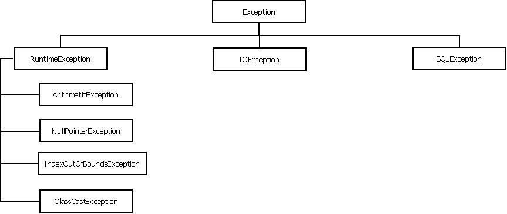
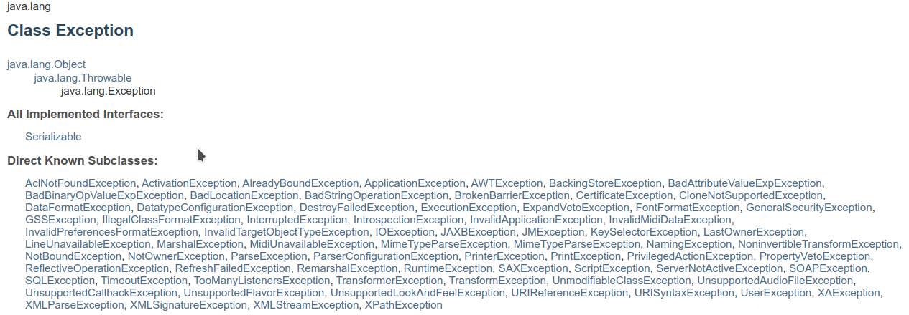
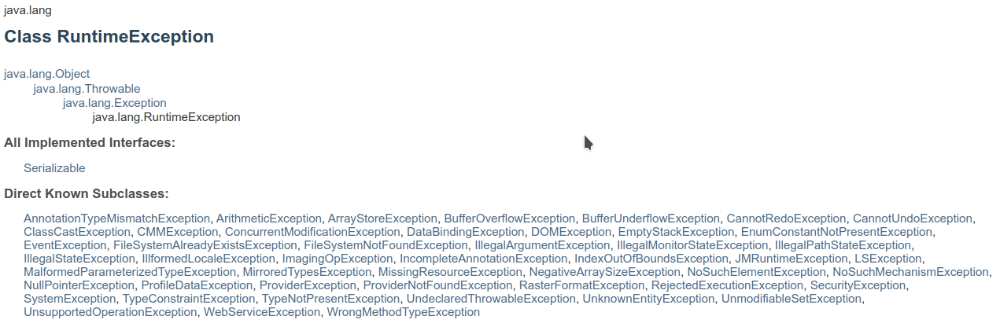
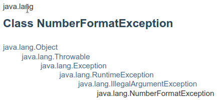

# Errores y Excepciones

## Excepciones

En java, existen clases llamadas **Excepciones** (Exceptions) que representan eventos que interrumpen la ejecución o flujo normal del sistema. Nosotros ya hemos tenido algún contanco con las excepciones en algún momento. Las excepciones normalmente tienen nombre que terminan con *Exception*: `NullPointerException`, `ClassCastException`, `ArrayIndexOutOfBoundsException`, por mencionar algunas.

Podemos definir una **Excepción** como una situación anómala que puede producirse durante la ejecución de un programa, como puede ser un intento de división entre  0, un acceso a posiciones de un array fuera de los límites del mismo o un fallo durante la lectura de datos de la entrada/salida. Mediante la captura de excepciones, java proporciona un mecanismo que permite al programa sobreponerse a estas situaciones, pudiendo el programador decidir las acciones a realizar para cada tipo de excepción que pueda ocurrir.

Cada objeto **Excepción** puede ser lanzada (generada) ya sea: automáticamente por la JVM (Máquina virtual de Java) o por el código de la aplicación, utilizando el comando `throw`. Si un bloque de código lanza una excepción, se puede ulizar los bloques `try-catch` o `try-catch-finally` para capturar y manejar la excepción. En caso de que excepción no ha sido capturada y/o manejada, ésta se propaga completamente fuera de la aplicación a la JVM y la obligará a salir (y abortar la ejecución de la aplicación).

Un ejemplo del manejo de excepciones se muestra en el siguiente código:

```Java
package U1_ManejodeErroresyExcepciones.ejemplos;

public class ExceptionExample1 {

    public static void main(String[] args) {
        int x = 11;
        try {
            if (x > 10) {
                throw new RuntimeException("El valor de x esta fuera de rango: " + x);
            }
        }
        catch (RuntimeException ex) {
            System.out.println(ex.getMessage());
        }
    }
}
```

Algunas veces es necesario ejecutar algún código independientemente si se lanzó/capturó una escepción o no. En lugar de repetir el mismo bloque de cópdigo en dos lugares, se puede utilizar un bloque `finally` de la siguiente manera:

```Java
package U1_ManejodeErroresyExcepciones.ejemplos;

public class ExceptionExample2 {

    public static void main(String[] args) {
        try {
            int x = 9;
            if (x > 10) {
                throw new RuntimeException("El valor de x esta fuera de rango: " + x);
            }
            // procesamiento normal del método
            System.out.println("Proceso normal del método");
        }
        catch(RuntimeException e) {
            System.out.println(e.getMessage());
        }
        finally {
            System.out.println("Este código siempre se llevará a cabo");
        }
    }
}
```

Si ejecutamos el código anterior con `x=11` se generará la excepción `RuntimeException` y a partir de ese punto se ejecutará el bloque `catch(RuntimeException e)` sin continuar con el flujo normal teniendo la salida:

```
El valor de x esta fuera de rango: 11
Este código siempre se llevará a cabo
```

Per si ejecutamos el mismo código con `x=9` se ejecutará el flujo normal teniendo la salida

```
Proceso normal del método
Este código siempre se llevará a cabo
```

Obervamos en cualquiera de los casos el código dentro del bloque `finally` siempre se ejecuta.

---

## El framework de Excepciones en java

Observemenos el siguiente código:

```Java
package U1_ManejodeErroresyExcepciones.ejemplos;

public class ExceptionExample3 {

    public static void main(String[] args) {
        try {
            metodo1(null);
        }
        catch (Exception e) {
            System.out.println(e.getClass().getCanonicalName());

            e.printStackTrace();

            if (e instanceof NullPointerException) {
                System.out.println("La excepción pertenece a NullPointerException");
            }
            else {
                System.out.println("Es otra excepcion");
            }
        }
    }

    public static void metodo1(String s) {
        if (s.equals("abc")) {
            System.out.println("Equals abc");
        }
        else {
            System.out.println("Not equal");
        }
    }
}
```

Si ejecutamos el código anterior tendriamos la salida:

```
java.lang.NullPointerException
java.lang.NullPointerException
	at U1_ManejodeErroresyExcepciones.ejemplos.ExceptionExample3.metodo1(ExceptionExample3.java:24)
	at U1_ManejodeErroresyExcepciones.ejemplos.ExceptionExample3.main(ExceptionExample3.java:7)
La excepción pertenece a NullPointerException
```

La salida entre las líneas 3 y 5 se le conoce como **pila de excepciones (Stack Trace)**, que en pocas palabras el la propagación de la excepción a lo largo de las llamadas de métodos hasta llegar a la JVM. Cuando ocurre una excepción, todo el contenido de la pila se devuelve como el seguimiento de la exepción. Ésto nos permite rastrear la línea de código que causó el problema. Para evitar que esto suceda, se puede detectar la excepción y se ejecuta algún código para recuperarse de dicha condición.

El objetivo del manejo de excepciones en Java es proteger el código de la aplicación de una condición inesperada y recuperarse de él, si es posible.

---

## Excepciones y Errores

Si observamos la siguente figura que corresponde a la documentación del paquete `java.lang`, veremos que contiene un gran cantidad de clases de excepciones y errores. Ambas clases se extienden de la clase `java.lang.Throwable` y por lo tanto heredar todos lo métodos de ella. 

El caso particular de la sub-clases de la clase `Error` y de acuerdo a la documentación oficial indica que: **un `Error` indica problemas serios que una aplicación razonable no debería intentar manejar**, es decir, un error representa una situación anormal irreversible, como por ejemplo un fallo de la máquina virtual; y por regla general, un programa no deberá intentar recuperarse de un error, dado que son situaciones que se escapan al control del programador.

Algunos ejemplos de clases heredadas de la clase `Error` son:

  > * `OutOfMemoryError`: Lanzado cuando JVM se queda sin memoria y no puede limpiarlo mediante la recolección de basura.
  > * `StackOverflowError`: Lanzado cuando la memoria asignada para la pila de llamadas al método no es suficiente para almacenar otro marco de pila. Se puede presentar en programas recursivos.
  > * `NoClassDefFoundError`: Lanzado cuando JVM no puede encontrar la definición de la clase solicitada por la clase cargada actualmente.

Las excepciones, por otro lado, generalmente están relacionadas con los problemas específicos de la aplicación y, a menudo, no requieren que se termine la aplicación y se busque la recuperación de la misma. Es por eso que generalmente se implementa una ruta alternativa (al flujo principal) de la lógica de la aplicación, o al menos informan el problema sin cerrar la aplicación.

En resumen: cada tipo de excepción está representada por una subclase de `Exception`, mientras que los errores son subclases de `Error`. Ambas clases, Exception y Error, son subclases de `Throwable`, tal como se muestra en la siguiente figura


Al producirse una excepción en un programa, se crea un objeto de la subclase de Exception a la que pertenece la excepción. Como veremos más adelante, este objeto puede ser utilizado por el programa durante el tratamiento de la excepción para obtener información de la misma.



Desde el punto de vista del tratamiento de una excepción dentro de un programa, hay que tener en cuenta que todas estas clases de excepción se dividen en dos grandes grupos:
  * Excepciones marcadas.
  * Excepciones no marcadas.


### Excepciones marcadas

Se entiende por excepciones marcadas aquéllas cuya captura es obligatoria. Normalmente, este tipo de excepciones se producen al invocar a ciertos métodos de determinadas clases y son generadas (lanzadas) desde el interior de dichos métodos como consecuencia de algún fallo durante la ejecución de los mismos.

Normalmente las excepciones que no heredan de la clase  `java.lang.RuntimeException` se denominan **excepciones marcadas**. La razón de tal nombre es que un compilador se asegura (verifica) de que estas excepciones estén atrapadas en los bloques `try-catch`. Este diseño obliga al programador a tomar una decisión consciente, ya sea para detectar la excepción marcada o informar al cliente que el método puede lanzar esta excepción y debe ser procesada (manejada) por el cliente.

Un ejemplo de excepciones marcadas se muestra en el siguiente código:

```Java
package U1_ManejodeErroresyExcepciones.ejemplos;

import java.io.BufferedReader;
import java.io.FileReader;
import java.io.File;

public class CheckedExceptionExample {

    public static void main(String[] args) {
        showFileContent("ejemplo.txt");
    }

    public static void showFileContent(String path) {
        File file = new File(path);

        FileReader fr = new FileReader(file);
        BufferedReader br = new BufferedReader(fr);

        String line;

        while ((line = br.readLine()) != null) {
            System.out.println(line);
        }
    }

}
```

Que al intentar compilar lanza la siguiente pila de excepciones:

```
CheckedExceptionExample.java:16: error: unreported exception FileNotFoundException; must be caught or declared to be thrown
        FileReader fr = new FileReader(file);
                        ^
CheckedExceptionExample.java:21: error: unreported exception IOException; must be caught or declared to be thrown
        while ((line = br.readLine()) != null) {
```

Como se observa, el programador esta obligado a declarar dichas líneas entre bloques de código `try-catch`. Teniendo la solución en el siguiente código:

```Java
package U1_ManejodeErroresyExcepciones.ejemplos;

import java.io.BufferedReader;
import java.io.FileReader;
import java.io.IOException;
import java.io.File;
import java.io.FileNotFoundException;

public class CheckedExceptionExample {

    public static void main(String[] args) {
        showFileContent("ejemplo.txt");
    }

    public static void showFileContent(String path) {
        File file = new File(path);

        try {
            FileReader fr = new FileReader(file);
            BufferedReader br = new BufferedReader(fr);

            String line;

            while ((line = br.readLine()) != null) {
                System.out.println(line);
            }
        }
        catch (FileNotFoundException e) {
            // código de recuperación del sistema
            e.printStackTrace();
        }
        catch(IOException e) {
            // código de recuperación del sistema
            e.printStackTrace();
        }
    }

}
```

Todas las clases de excepciones, salvo `RuntimeException` y sus subclases, pertenecen a las excepciones marcadas. En el ejemplo la excepción marcada es `IOException`. Esta excepción es lanzada por el método `readLine()` de la clase `BufferedReader` cuando se produce un error durante la operación de lectura, lo que obliga al programa que va a hacer uso de dicho método a capturar la excepción. Así mismo, la excepción `FileNotFoundException` es lanzada duando el constructor de la clase `FileReader` no encuentra el archivo especificado.

Si un bloque de código se invoca a algún método que puede provocar una excepción marcada y si ésta no se captura, el programa no se compilará.

### Excepciones no marcadas

Normalmente las Excepciones que se extienden de la clase `java.lang.RuntimeException` son **excepciones no marcadas**, entre ella existen `NullPointerException`, `ArrayIndexOutOfBoundsException`, `ClassCastException`, y `NumberFormatException`, entre otras Todas éstas pertenecen al grupo de excepciones de *tiempo de ejecución*, es decir, `RuntimeException` y todas sus subclases. No es obligatorio capturar dentro de un programa Java una excepción no marcada, el motivo es que gran parte de ellas se producen como consecuencia de una mala programación.

Si durante la ejecución de un programa Java se produce una excepción y ésta no es capturada, la máquina virtual provoca la finalización inmediata del mismo, enviando a la consola el volcado de la pila con los datos de la excepción.

Se analiza el siguiente ejemplo:

```Java
package U1_ManejodeErroresyExcepciones.ejemplos;

public class UncheckedExceptionExample {

    public static void main(String[] args) {

        System.out.println(division(10, -50));
    }

    public static float division(int dividendo, int divisor) {
        float cociente = dividendo / divisor;
        return cociente;
    }
}
```
Cuando ejecutamos el código anterior utilizando `dividendo=10` y `divisor=5` o cualquier número distinto a `0` el programa se ejecutará sin problema. Sin embargo, si ejecutamos el código utilizando `divisor=0` se lanzará la siguiente Excepción:

```
Exception in thread "main" java.lang.ArithmeticException: / by zero
        at U1_ManejodeErroresyExcepciones.ejemplos.UncheckedExceptionExample.division(UncheckedExceptionExample.java:11)
        at U1_ManejodeErroresyExcepciones.ejemplos.UncheckedExceptionExample.main(UncheckedExceptionExample.java:7)
```

Analice el siguiente ejemplo.

```Java
package U1_ManejodeErroresyExcepciones.ejemplos;

import java.util.Scanner;


public class UncheckedExceptionExample2 {

    public static void main(String[] args) {


        Scanner in = new Scanner(System.in);

        System.out.println("Digite el tamaño del array: ");
        
        System.out.println(obtenerArray(in.nextInt()).length);
    }

    public static int[] obtenerArray(int tam) {
        int tmpArray[] = new int[tam];

        return tmpArray;
    }
}
```

El metodo `obtenerArray(int tam)` genera en tiempo de ejecución un arreglo (array) del tamaño indicado en el parámetro `tam`. Sin embargo, el programa lanzará la siguiente excepción cuando ingresemos un entero negativo.

```Java
Digite el tamaño del array: 
-5
Exception in thread "main" java.lang.NegativeArraySizeException: -5
        at U1_ManejodeErroresyExcepciones.ejemplos.UncheckedExceptionExample2.obtenerArray(UncheckedExceptionExample2.java:19)
        at U1_ManejodeErroresyExcepciones.ejemplos.UncheckedExceptionExample2.main(UncheckedExceptionExample2.java:15)
```

Cómo podemos observar, las excepciones **no marcadas** se generan principalmente por una mala lógica o por un mal diseño del programa.

---

## Manejo de Excepciones

### Bloques `try`, `catch` y `finally`

Cuando una excepción es lanzada dentro de un bloque `try`, el flujo de control se redirecciona al primer bloque `catch`. Si no existe un bloque `catch` que capture y maneje la excepción (pero el bloque `finally` tiene que estar declarado), la excepción se propaga hacia arriba y hacia afuera del método. Si hay más de una cláusula catch, el compilador lo obliga a organizarlas para que la excepción secundaria aparezca antes que la excepción principal.

Observe el siguente código (modificación de ExceptionExample3.java):

```Java
package U1_ManejodeErroresyExcepciones.ejemplos;

public class ExceptionExample3 {

    public static void main(String[] args) {
        try {
            metodo1(null);
        }
        catch (NullPointerException e) {
            e.printStackTrace();
        }
        catch (Exception e) {
            e.printStackTrace();
        }
    }

    public static void metodo1(String s) {
        if (s.equals("abc")) {
            System.out.println("Equals abc");
        }
        else {
            System.out.println("Not equal");
        }
    }
}
```

En el ejemplo anterior, se coloca un bloque catch con `NullPointerException` antes del bloque con `Exception` porque `NullPointerException` extiende de `RuntimeException`, que, a su vez, extiende de `Exception`. Incluso podríamos implementar este ejemplo de la siguiente manera:

```Java
public static void main(String[] args) {
        try {
            metodo1(null);
        }
        catch (NullPointerException e) {
            e.printStackTrace();
        }
        catch (RuntimeException e) {
            e.printStackTrace();
        }
        catch (Exception e) {
            e.printStackTrace();
        }
    }
```

En el primer bloque `catch` captura solo `NullPointerException`. La segunda cláusula `catch` capturará otras excepciones que extiendan `RuntimeException`. El resto de los tipos de excepción (todas las excepciones marcadas) serán capturados por el último bloque de captura.

Tener un bloque `catch` para cada tipo de excepción nos permite proporcionar un procesamiento específico de tipo de excepción. Sin embargo, *si no hay diferencia* en el procesamiento de excepciones, se puede tener un solo bloque `catch` con la clase base `Exception` para capturar todo tipo de excepciones.

```Java
public static void main(String[] args) {
        try {
            metodo1(null);
        }
        catch (Exception e) {
            e.printStackTrace();
        }
    }
```

Si ninguna de las cláusulas captura la excepción, se lanza hasta que sea manejada por una declaración `try` ... `catch` en uno de los métodos que llaman o se propaga completamente fuera del código de la aplicación. En tal caso, JVM finaliza la aplicación y sale.

[comment]: <> (Aquí hace falta un ejemplo que muestre el comportamiento del parrafo anterior)

## Sentencias `try`-`catch` con recursos

Agregar un bloque `finally` no cambia el comportamiento descrito en el ejemplo anterior. Si está presente, siempre se ejecuta, se haya generado una excepción o no. Un bloque `finally` se usa generalmente para liberar los recursos, para cerrar una conexión de base de datos, un archivo y similares. Sin embargo, si el recurso implementa la interfaz `Closeable`, es mejor usar la instrucción `try-with-resources` que permite liberar los recursos automáticamente. Se observa el siguiente ejemplo:

```Java
package U1_ManejodeErroresyExcepciones.ejemplos;

import java.io.File;
import java.io.FileNotFoundException;
import java.util.Scanner;

public class HandleException1 {

    public static void main(String[] args) {
        String filePath = "U1_ManejodeErroresyExcepciones/ejemplos/lorem_ipsum.txt";

        System.out.println(readFromFile_oldWay(filePath));
    }

    public static String readFromFile(String path) {
        String text = new String("");

        // try con recursos.
        try (Scanner s = new Scanner(new File(path));) {  
            while (s.hasNextLine()) {
                text += s.nextLine();
            }
        }
        catch(FileNotFoundException e)
        {
            System.out.println("No es posible leer el archivo: " + path);
            e.printStackTrace();
        }
        // No necesita bloque finally
        
        return text;
   }

   public static String readFromFile_oldWay(String path) {
       String text = new String("");
       Scanner s = null;

       try {
           s = new Scanner(new File(path));
           while (s.hasNextLine()) {
               text += s.nextLine();
           }
       }
       catch (FileNotFoundException e) {
            System.out.println("No es posible leer el archivo: " + path);
            e.printStackTrace();
       }
       finally {
           if (s != null) s.close();
       }

       return text;
   }

}
```

Cómo se puede observar, el método `String readFromFile_oldWay(String path)` implemenenta el cierre explicito de la clase `Scanner` utilizando un bloque `finally`. Sin embargo, dado que `Scanner` implementa la interfac `Closeable` el recurso se cierra automáticamente, es decir, se realiza un cierre implicito.

---

## Propagación de la excepción con `throw` y `throws`

Como se ha visto hasta ahora, el manejo de excepciones se realiza mediente los comandos `try`, `catch` y `finally`. Sin embargo, existen ocasiones que se necesita "lanzar" una excepción de acuerdo a una lógica de programación o diseño del flujo del programa. Ésto se da, cuando no se requiere el manejo de una excepción lanzada por el sistema, si no por lo contrario, es el programador quien decide lanzar una excepción. Analicemos el siguiente ejemplo:

```Java
package U1_ManejodeErroresyExcepciones.ejemplos;

/**
 * clase que almacena sólo números pares
 */
public class EvenInteger {

    Integer intValue;

    public EvenInteger(int n) {
        if (n%2 != 0) {
            // Si n no es impar se lanzará una excepción de tipo NumberFormatException
            throw new NumberFormatException("Sólo se pueden almacenar números pares");
        }

        this.intValue = n;
    }

    @Override
    public String toString() {
        return intValue.toString();
    }
}
```

```Java
package U1_ManejodeErroresyExcepciones.ejemplos;

public class ThrowExample {

    public static void main(String[] args) {
        EvenInteger ei = new EvenInteger(2);

        System.out.println(ei);
    }
}
```

En el ejemplo anterior la case `EvenInteger` se implementa para almacenar números enteros pares, sin embargo, si instanciamos con un número no entero lanzará la excepción `NumberFormatException`. En la clase `ThrowExample` si instanciamos con `new EvenInteger(3)` se propagará la excepción antes mencionada de manera implicita (*Excepción no marcada*).

```
Exception in thread "main" java.lang.NumberFormatException: Sólo se pueden almacenar números pares
        at U1_ManejodeErroresyExcepciones.ejemplos.EvenInteger.<init>(EvenInteger.java:12)
        at U1_ManejodeErroresyExcepciones.ejemplos.ThrowExample.main(ThrowExample.java:6)
```

### Propagación de la Excepción con `throws`

Hasta este momento se ha capturado y manejado las excepciones en el momento y método que las genera, ésto mediante el uso de los bloques `try`, `catch` y `finally`. Sin embargo, existen ocasiones en donde no se require el manejo inmediado de la excepción, si no delegar esa acción a otro método. 

Analice el siguiente ejemplo:

```Java
package U1_ManejodeErroresyExcepciones.ejemplos;

import java.util.Vector;

public class ThrowExample {

    public static void main(String[] args) {
        int evenNumbers[] = {3, 4, 7, 8, 9};
        Vector<EvenInteger> vei = new Vector<EvenInteger>();

        for (int element : evenNumbers) {
            try {
                vei.add(boxInteger(element));
            }
            catch(NumberFormatException e) {
                vei.add(boxInteger(element - 1)); // se resta 1 al número a ingresar
            }
        }

        vei.forEach(vecItem->System.out.println(vecItem));
        
    }

    // No se maneja la Excepción, sólo se propaga hacia arriba en la pila de llamadas
    public static EvenInteger boxInteger(int n) throws NumberFormatException {
        EvenInteger ei = new EvenInteger(n);

        return ei;
    }

}
```

En el ejemplo anterior, el método `EvenInteger boxInteger(int n)` no es el responsable de la captura y manejo de la excepción, si no que delega el manejo al bloque `try`-`catch` del método main, quien decidirá las acciones a seguir en caso de excepción.

Observemos parte de la pila de la excepción cuando no es manejada la excepción:

```
java.lang.NumberFormatException: Sólo se pueden almacenar números pares
        at U1_ManejodeErroresyExcepciones.ejemplos.EvenInteger.<init>(EvenInteger.java:12)
        at U1_ManejodeErroresyExcepciones.ejemplos.ThrowExample.boxInteger(ThrowExample.java:25)
        at U1_ManejodeErroresyExcepciones.ejemplos.ThrowExample.main(ThrowExample.java:13)
```

Observamos que la excepción pasa a través de `boxInteger` para ser manejada por el método `main`.

---

## Implementación de Excepciones propias.

Como se ha visto hasta el momento, java tiene un conjunto de excepciones muy grande:





no obstante, existen ocasiones en donde no exista una excepción para un caso particular, o bien, necesitemos incrementar la limpiesa de nuestro código (y a su vez su elegancia).

Dado lo anterior, Java permite la implemetanción de nuevas excepciones mediente la extención de la clase `Exception` o alguna de sus sub-clases.


### Excepciones no marcadas propias.

Cómo se mencionó anteriormente, una excepción que herede (directa o indirectamente) de la clase `RuntimeException` será una **excepción no marcada**. Veamos la implementación de una nueva excepción para el problema del contenedor de números páres.

```Java
package U1_ManejodeErroresyExcepciones.ejemplos;

public class NotEvenIntegerException extends NumberFormatException {

    public NotEvenIntegerException() {
        super();
    }

    public NotEvenIntegerException(String s) {
        super(s);
    }
}
```

Actualizamos las clases `EvenInteger` y `ThrowExample`

```Java
// Sólo se muestra el segmento actualizado
public EvenInteger(int n) {
        if (n%2 != 0) {
            throw new NotEvenIntegerException("Sólo se pueden almacenar números pares");
        }

        this.intValue = n;
    }
```

```Java
// Sólo se muestran los segmentos actualizados
vei.add(boxInteger(element));
...

public static EvenInteger boxInteger(int n) throws NotEvenIntegerException {
```

Si ejecutamos el código anterior y no manejamos la excepción, se mostrará la siguiente pila de excepciones:

```
U1_ManejodeErroresyExcepciones.ejemplos.NotEvenIntegerException: Sólo se pueden almacenar números pares
        at U1_ManejodeErroresyExcepciones.ejemplos.EvenInteger.<init>(EvenInteger.java:12)
        at U1_ManejodeErroresyExcepciones.ejemplos.ThrowExample.boxInteger(ThrowExample.java:25)
        at U1_ManejodeErroresyExcepciones.ejemplos.ThrowExample.main(ThrowExample.java:13)
```

Se observa que no se requiere la implementación de un bloque `try`-`catch` debido a que la clase `NotEvenInteger` hereda (indirecamente) de la clase `RuntimeException` a través de `NumberFormatException`, por lo cual, es una **excepción no marcada**:



### Excepciones marcadas propias

Cómo se dijo anteriormente, las excepciones **no marcadas** son subclases de la clase `RuntimeException`, por lo tanto, para poder implementar **excepciones marcadas** propias, **NO** deben extender de la clase `RuntimeException`. Por convención, éstas excepciones heredan directamente de la clase `Exception`. Veamos el ejemplo:

```Java
package U1_ManejodeErroresyExcepciones.ejemplos;

public class NotEvenIntegerException extends Exception {

    public NotEvenIntegerException() {
        super();
    }

    public NotEvenIntegerException(String s) {
        super(s);
    }
}
```

Observamos que ahora, el compilador me exige manejar la excepción marcada:

```
$ javac -cp . U1_ManejodeErroresyExcepciones/ejemplos/EvenInteger.java                                                                                      [::]
U1_ManejodeErroresyExcepciones/ejemplos/EvenInteger.java:12: error: unreported exception NotEvenIntegerException; must be caught or declared to be thrown
            throw new NotEvenIntegerException("Sólo se pueden almacenar números pares");
            ^
1 error
```

solución:

```Java
 public EvenInteger(int n) throws NotEvenIntegerException {
        if (n%2 != 0) {
            throw new NotEvenIntegerException("Sólo se pueden almacenar números pares");
        }

        this.intValue = n;
    }
```

Lo mismo pasa con la clase `ThrowExample`:

```
javac -cp . U1_ManejodeErroresyExcepciones/ejemplos/ThrowExample.java                                                                                     [13:44:43]
U1_ManejodeErroresyExcepciones/ejemplos/ThrowExample.java:12: error: unreported exception NotEvenIntegerException; must be caught or declared to be thrown
            vei.add(boxInteger(element));            
                              ^
1 error
```

Soluctión:

```Java
for (int element : evenNumbers) {
            try {
                vei.add(boxInteger(element));
            } catch (NotEvenIntegerException e) {
                // se maneja realiza el flujo alternativo
                e.printStackTrace();
            }
        }
```

### Implementar nuevos métodos en las Excepciones propias

Cómo cualquier nueva clase, las excepciones propias también pueden implementar nuevos métodos. sin embargo, **No se recomienda** ya que su uso incrementa la complejidad del mantenimiento del código y disminuye su facilidad de lectura.

