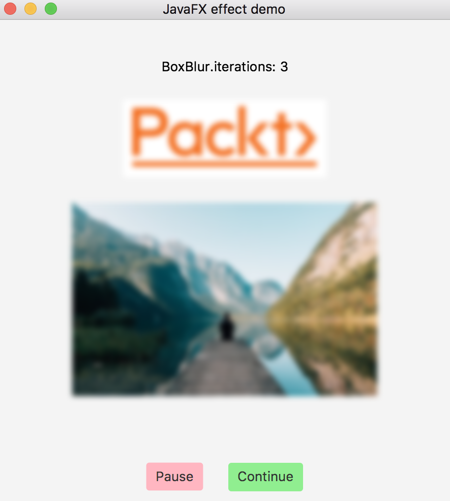
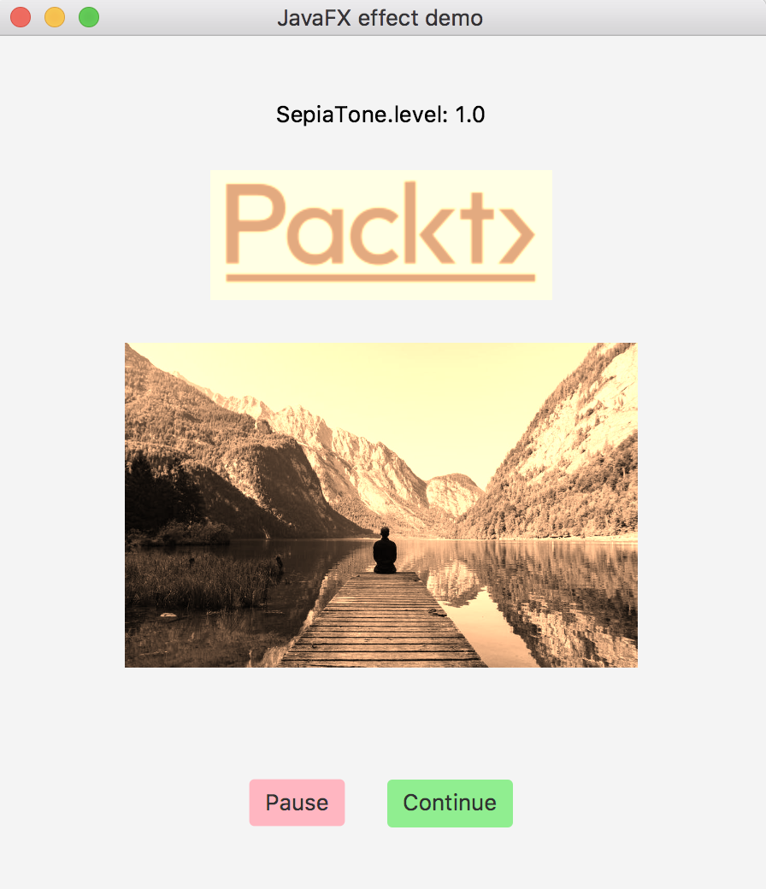

# Programación Java GUI

En cierto sentido, la GUI es la parte más importante de una aplicación. Interactúa directamente con el usuario. Si la GUI es inconveniente, poco atractiva para los ojos o confusa, incluso las mejores soluciones de back-end pueden no justificar al usuario para usar esta aplicación. Por el contrario, una buena GUI intuitiva y bien diseñada ayuda a retener al usuario incluso si la aplicación no hace el trabajo tan bien como sus competidores.

El nombre **Java Foundation Classes (JFC)** puede ser una fuente de mucha confusión. Implica las clases que están en la base de Java, mientras que, de hecho, JFC incluye solo clases e interfaces relacionadas con la GUI. Para ser precisos, JFC es una colección de tres marcos: **Abstract Window Toolkit (AWT)**, Swing y Java 2D.

JFC es parte de **Java Class Library (JCL)**, aunque el nombre JFC surgió solo en 1997, mientras que AWT fue parte de JCL desde el principio. En ese momento, Netscape desarrolló una biblioteca GUI llamada **Internet Foundation Classes (IFC)** y Microsoft creó **Application Foundation Classes (AFC)** para el desarrollo de GUI también. Entonces, cuando Sun Microsystems y Netscape decidieron formar una nueva biblioteca GUI, heredaron la palabra Foundation y crearon JFC. El framework Swing se hizo cargo de la programación de la GUI de Java de AWT y se utilizó con éxito durante casi dos décadas.

Se agregó un nuevo kit de herramientas de programación GUI JavaFX a JCL en Java 8. Se eliminó de JCL en Java 11 y, desde entonces, ha residido como un proyecto de código abierto respaldado por la compañía Gluon como un módulo descargable además del JDK. JavaFX utiliza un enfoque algo diferente para la programación de la GUI que AWT y Swing. Presenta un diseño más consistente y simple, y tiene una buena oportunidad de ser un kit de herramientas de programación GUI de Java.

## Fundamentos de JavaFX

Ciudades como Nueva York, Londres, París y Moscú tienen muchos teatros, y las personas que viven allí no pueden evitar escuchar sobre nuevas obras y producciones casi semanalmente. Los hace inevitablemente familiarizados con la terminología del teatro, entre los cuales los términos *escenario, escena y evento* probablemente se usan con mayor frecuencia. Estos tres términos también son la base de una estructura de aplicación JavaFX.

El contenedor de nivel superior en JavaFX que contiene todos los demás componentes está representado por la clase `javafx.stage.Stage`. Entonces, puede decir que, en la aplicación JavaFX, todo sucede en un escenario. Desde la perspectiva del usuario, es un área de visualización o ventana donde todos los controles y componentes realizan sus acciones (como actores en un teatro). Y, de manera similar a los actores de un teatro, lo hacen en el contexto de una escena, representada por la clase `javafx.scene.Scene`. Por lo tanto, una aplicación JavaFX, como una obra de teatro en un teatro, se compone de objetos `Scene` presentados dentro del objeto `Stage` uno a la vez. Cada objeto `Scene` contiene un gráfico que define las posiciones de los actores de la escena, llamados nodos, en JavaFX: controles, diseños, grupos, formas, etc. Cada uno de ellos extiende la clase abstracta, `javafx.scene.Node`.

Algunos de los controles de nodos están asociados con eventos: un botón al que se hace clic o una casilla de verificación marcada, por ejemplo. Estos eventos pueden ser procesados ​​por el controlador de eventos asociado con el elemento de control correspondiente.

La clase principal de la aplicación JavaFX tiene que extender la clase abstracta, `java.application.Application` que tiene varios métodos de ciclo de vida. Los enumeramos en la secuencia de la invocación: `launch()`, `init()`, `notifyPreloader()`, `start()`, `stop()`. Parece que son bastantes para recordar. Pero, muy probablemente, solo necesita implementar un método, `start ()`, donde se construye y ejecuta la GUI real. Entonces, revisaremos todos los métodos solo para completar:

  > * `static void launch(Class<? extends Application> appClass, String... args)`: Inicia la aplicación, a menudo llamada por el método principal; no regresa hasta que se llama a `Platform.exit()` o se cierran todas las ventanas de la aplicación; el parámetro `appClass` debe ser una subclase pública de `Application` con un constructor público sin argumentos.
  > * `static void launch(String... args)`: igual que el método anterior, suponiendo que la subclase pública de `Application` es la clase que encierra inmediatamente; Este es el método más utilizado para iniciar la aplicación JavaFX.
  > * `void init()`: se llama a este método después de cargar la clase `Application`; normalmente se usa para algún tipo de inicialización de recursos; la implementación predeterminada no hace nada.
  > * `void notifyPreloader (Preloader.PreloaderNotification info)`: se puede usar para mostrar el progreso cuando la inicialización lleva mucho tiempo.
  > * `abstract void start(Stage primaryStage)`: Se llama después de que el método `init()` regresa, y después de que el sistema está listo para hacer el trabajo principal; El parámetro `primaryStage` es el escenario en la que la aplicación presentará sus escenas.
  > * `void stop()`: se llama cuando la aplicación debe detenerse; puede usarse para liberar los recursos; la implementación predeterminada no hace nada.

La API del kit de herramientas JavaFX se puede encontrar en línea [https://openjfx.io/javadoc/11/](https://openjfx.io/javadoc/11/). Oracle también proporciona una extensa documentación y ejemplos de código [https://docs.oracle.com/javafx/2/](https://docs.oracle.com/javafx/2/). La documentación incluye la descripción y el manual de usuario de Scene Builder (una herramienta de desarrollo) que proporciona un entorno de diseño visual y le permite diseñar rápidamente una interfaz de usuario para la aplicación JavaFX sin escribir ningún código. Esta herramienta puede ser útil para crear una GUI compleja e intrincada, y muchas personas lo hacen todo el tiempo. En este curso nos concentraremos en la escritura de códigos JavaFX sin usar esta herramienta.

Para poder hacerlo, los siguientes son los pasos necesarios:

  > 1. Agrega la siguiente dependencia al `pom.xml` de tu proyecto maven

  > ```XML
  > <dependency>
  >   <groupId>org.openjfx</groupId>
  >   <artifactId>javafx-controls</artifactId>
  >   <version>11</version>
  > </dependency>
  > <dependency>
  >   <groupId>org.openjfx</groupId>
  >   <artifactId>javafx-fxml</artifactId>
  >   <version>11</version>
  ></dependency>

  > 2. Descarga el JavaFX SDK dependiendo del sistema operativo que utilizas desde [https://gluonhq.com/products/javafx/](https://gluonhq.com/products/javafx/) y descomprímelo en cualquier directorio.
  > 3.Suponiendo que ha descomprimido JavaFX SDK en `/path/JavaFX/`, agrega las siguientes opciones al comando Java que lanzará su aplicación JavaFX en la plataforma Linux:

  > `--module-path /path/JavaFX/lib -add-modules=javafx.controls,javafx.fxml`

`/path/JavaFX/` es la ruta que debe sustituir por la ruta real a la carpeta que contiene JavaFX SDK.

Suponiendo que la clase principal de la aplicación es `HelloWorld`, en el caso de IntelliJ, ingrese las opciones anteriores en el campo de opciones de VM de la siguiente manera:


Estas opciones deben agregarse a las configuraciones de ejecución y debug de las clases que utilicen JavaFX. Si prefiere un IDE diferente o tiene un sistema operativo diferente, puede encontrar recomendaciones sobre cómo configurarlo en la documentación de `openjfx.io` [https://openjfx.io/openjfx-docs/#introduction](https://openjfx.io/openjfx-docs/#introduction).

Para ejecutar la clase `HelloWorld` desde la línea de comandos, use los siguientes comandos en la plataforma Linux en el directorio raíz del proyecto (donde se encuentra el archivo `pom.xml`):

  > `mvn clean package`

  > `java --module-path /path/javaFX/lib --add-modules=javafx.controls,javafx.fxml -cp target/learnjava-1.0-SNAPSHOT.jar:target/libs/* com.spolancom.HelloWorld`

Aquí está la aplicación `HelloWorld` con JavaFX que muestra el texto, ¡Hola Mundo! y Salir:

```Java
import javafx.application.Application;
import javafx.application.Platform;
import javafx.scene.Scene;
import javafx.scene.control.Button;
import javafx.scene.layout.Pane;
import javafx.scene.text.Text;
import javafx.stage.Stage;

/**
 * JavaFX App
 */
public class App extends Application {

    @Override
    public void start(Stage primaryStage) {
        Text txt = new Text("Hello World!");
        txt.relocate(135, 40);

        Button btn = new Button("Exit");
        btn.relocate(155, 80);

        btn.setOnAction(actionEvent -> {
            System.out.println("Bye! See you later!");
            Platform.exit();
        });

        Pane pane = new Pane();
        pane.getChildren().addAll(txt, btn);

        primaryStage.setTitle("The primary stage (top-level container)");
        primaryStage.onCloseRequestProperty()
                .setValue(e -> System.out.println("Bye! See you later!"));
        primaryStage.setScene(new Scene(pane, 350, 150));
        primaryStage.show();
    }

    public static void main(String[] args) {
        launch(args);
    }

    @Override
    public void stop() {
        System.out.println("Doing what has to be done before closing");
    }
}
```

Como puede ver, la aplicación se inicia llamando al método estático `Application.launch(String ... args)`. El método de `start (Stage primaryStage)` crea un nodo `Text` con el mensaje *Hello, World!* ubicado en la posición absoluta 135 (horizontalmente) y 40 (verticalmente). Luego, crea otro nodo `Button` con el texto, *Exit*, ubicado en la posición absoluta 155 (horizontalmente) y 80 (verticalmente). La acción, asignada al botón (cuando se hace clic), imprime `"Bye! See you later!"` en una pantalla y obliga a la aplicación a salir utilizando el método `Platform.exit ()`. Estos dos nodos se agregan como elementos secundarios al panel de diseño que permite el posicionamiento absoluto.

El objeto `Stage` se le asignó el título `"The primary stage (top-level container)"`. También asignó una acción al hacer clic en el símbolo de cerrar la ventana (botón x) en la esquina superior de la ventana.

El panel de diseño creado se establece en un objeto `Scene`. El tamaño de la escena será 350 horizontal y 150 verticalmente. El objeto de la escena se coloca en el escenario. Luego, el escenario se muestra llamando al método `show()`.

Si ejecutamos la aplicación anterior, aparecerá la siguiente ventana:


Al hacer clic en el botón o en el botón x en la esquina superior, se muestra el mensaje esperado:

```
Bye! See you later!
```

Pero, si necesita hacer algo más después de hacer clic en el botón x y cerrar la ventana, puede agregar una implementación del método `stop()` a la clase `HelloWorld`. Por ejemplo, puede verse de la siguiente manera:

```Java
@Override
public void stop(){
    System.out.println("Doing what has to be done before closing");
}
```

Si lo hizo, luego de hacer clic en el botón x, la pantalla mostrará esto:

```
Bye! See you later!
Doing what has to be done before closing
```

Este ejemplo le da una idea de cómo funciona JavaFX. De ahora en adelante, mientras revisamos las capacidades de JavaFX, presentaremos solo el código en el método `start()`.

El kit de herramientas tiene una gran cantidad de paquetes, cada uno con muchas clases y cada clase con muchos métodos. No tenemos oportunidad de discutirlos todos. En cambio, vamos a presentar una descripción general de todas las áreas principales de la funcionalidad JavaFX y presentarla de la manera más simple y directa que podamos.

## Algunos elementos de control

Los **elementos de control** se incluyen en el paquete [`javafx.scene.control`](https://openjfx.io/javadoc/11/javafx.controls/javafx/scene/control/package-summary.html). Hay más de 80 de ellos, incluidos un botón, campo de texto, casilla de verificación, etiqueta, menú, barra de progreso y barra de desplazamiento, por nombrar algunos. Como ya hemos mencionado, cada elemento de control es una subclase de `Node` que tiene más de 200 métodos. Entonces, puede imaginar cuán rico y afinado puede ser una GUI, construida utilizando JavaFX. Sin embargo, el alcance de este libro nos permite cubrir solo unos pocos elementos y sus métodos.

Ya hemos visto un botón. Ahora usemos una etiqueta y un campo de texto para crear un formulario simple con campos de entrada (nombre, apellido y edad) y un botón de enviar. Lo construiremos en pasos. Todos los siguientes fragmentos de código son secciones secuenciales del método `start()`.

Primero, creemos controles:

```Java
Text txt = new Text("Fill the form and click Submit");
TextField tfFirstName = new TextField();
TextField tfLastName = new TextField();
TextField tfAge = new TextField();
Button btn = new Button("Submit");
btn.setOnAction(e-> action(tfFirstName, tfLastName, tfAge));
```

Como puede observar, el texto se usará como las instrucciones del formulario. El resto es bastante sencillo y se parece mucho a lo que hemos visto en el ejemplo `HelloWolrd`. `action()` es una función implementada como el siguiente método:

```Java
void action(TextField tfFirstName, TextField tfLastName, TextField tfAge ) {
    String fn = tfFirstName.getText();
    String ln = tfLastName.getText();
    String age = tfAge.getText();
    int a = 42;
    try {
        a = Integer.parseInt(age);
    } catch (Exception ex){}
    fn = fn.isBlank() ? "Nick" : fn;
    ln = ln.isBlank() ? "Samoylov" : ln;
    System.out.println("Hello, " + fn + " " + ln + ", age " + a + "!");
    Platform.exit();
}
```

Esta función acepta tres parámetros (los objetos `javafx.scene.control.TextField`), luego obtiene los valores de entrada enviados y simplemente los imprime. El código se asegura de que siempre haya algunos valores predeterminados disponibles para imprimir y de que ingresar un valor no numérico de edad no interrumpa la aplicación.

Con los controles y la acción en su lugar, los colocamos en un diseño de cuadrícula utilizando la clase `javafx.scene.layout.GridPane`:

```Java
GridPane grid = new GridPane();
grid.setAlignment(Pos.CENTER);
grid.setHgap(15);
grid.setVgap(5);
grid.setPadding(new Insets(20, 20, 20, 20));
```

El panel de diseño `GridPane` tiene filas y columnas que forman celdas en las que se pueden configurar los nodos. Los nodos pueden abarcar columnas y filas. El método `setAlignment()` establece la posición de la cuadrícula en el centro de una escena (la posición predeterminada es la esquina superior izquierda de una escena). Los métodos `setHgap()` y `setVgap()` establecen el espaciado (en píxeles) entre las columnas (horizontalmente) y las filas (verticalmente). El método `setPadding()` agrega algo de espacio a lo largo de los bordes del panel de cuadrícula. El objeto `Insets()` establece los valores (en píxeles) en el orden de arriba, derecha, abajo e izquierda.

Ahora vamos a colocar los nodos creados en las celdas correspondientes (organizadas en dos columnas):

```Java
int i = 0;
grid.add(txt,    1, i++, 2, 1);
GridPane.setHalignment(txt, HPos.CENTER);
grid.addRow(i++, new Label("First Name"), tfFirstName);
grid.addRow(i++, new Label("Last Name"),  tfLastName);
grid.addRow(i++, new Label("Age"), tfAge);
grid.add(btn,    1, i);
GridPane.setHalignment(btn, HPos.CENTER);
```

El método `add()` acepta tres o cinco parametros:

  > * El nodo, el índice de la columna, el índice de la fila
  > * El nodo, el índice de la columna, el índice de la fila, cuántas columnas abarcar, cuántas filas abarcar

Los índices de columnas y filas comienzan desde `0`.

El método `setHalignment()` establece la posición del nodo en la celda. La enumeración `HPos` tiene valores: LEFT, RIGHT, CENTER. El método `addRow (int i, Node... nodes)` acepta el índice de fila y los varargs de los nodos. Lo usamos para colocar la etiqueta y los objetos `TextField`.

El resto del método `start ()` es muy similar al ejemplo de `HellowWorld` (solo han cambiado el título y el tamaño):

```Java
primaryStage.setTitle("Simple form example");
primaryStage.onCloseRequestProperty()
        .setValue(e -> System.out.println("Bye! See you later!"));
primaryStage.setScene(new Scene(grid, 300, 200));
primaryStage.show();
```

Si ejecutamos el método `start()` el resultado sería:


Podemos utilizar el formulario, por ejemplo:


Después de dar click al botón *Submit*, se desplegará el siguiente mensaje en la consola:

```
Hello, John Grant, age 35
```

Para ayudar a visualizar el diseño, especialmente en el caso de un diseño más complejo, puede usar el método de cuadrícula `setGridLinesVisible(boolean v)` para hacer visibles las líneas de cuadrícula. Ayuda a ver cómo se alinean las celdas. Podemos agregar la siguiente línea a nuestro ejemplo:

  > `grid.setGridLinesVisible(true);`

Si ejecutamos nuevamente el programa el resultador sería:


Como puede ver, el diseño ahora se describe explícitamente, lo que nos ayuda a visualizar el diseño.

El paquete `javafx.scene.layout` incluye 24 clases de diseño como `Pane` (lo vimos en el ejemplo HelloWorld), `StackPane` (nos permite superponer nodos), `FlowPane` (permite que las posiciones de los nodos fluyan a medida que cambia el tamaño de la ventana) , `AnchorPane` (conserva la posición de los nodos en relación con su punto de anclaje), por nombrar algunos. 

## Gráficas

JavaFX proporciona los siguientes componentes de gráficos para la visualización de datos en el paquete `javafx.scene.chart`:

  > * `LineChart`: agrega una línea entre los puntos de datos en una serie; normalmente se usa para presentar las tendencias a lo largo del tiempo
  > * `AreaChart`: Similar al LineChart, pero llena el área entre la línea que conecta los puntos de datos y el eje; normalmente se usa para comparar totales acumulados a lo largo del tiempo
  > * `BarChart`: presenta los datos como barras rectangulares; utilizado para la visualización de datos discretos
  > * `PieChart`: presenta un círculo dividido en segmentos (rellenos con diferentes colores), cada segmento representa un valor como una proporción del total; lo demostraremos en esta sección
  > * `BubbleChart`: presenta datos como formas ovaladas bidimensionales llamadas burbujas que permiten presentar tres parámetros
  > * `ScatterChart`: presenta los puntos de datos en una serie tal cual; útil para identificar la presencia de una agrupación (correlación de datos)

El siguiente ejemplo demuestra cómo el resultado de las pruebas se puede presentar como un gráfico circular. Cada segmento representa el número de pruebas exitosas, fallidas o ignoradas:

```Java
Text txt = new Text("Test results:");

PieChart pc = new PieChart();
pc.getData().add(new PieChart.Data("Succeed", 143));
pc.getData().add(new PieChart.Data("Failed" ,  12));
pc.getData().add(new PieChart.Data("Ignored",  18));

VBox vb = new VBox(txt, pc);
vb.setAlignment(Pos.CENTER);
vb.setPadding(new Insets(10, 10, 10, 10));

primaryStage.setTitle("A chart example");
primaryStage.onCloseRequestProperty()
        .setValue(e:> System.out.println("Bye! See you later!"));
primaryStage.setScene(new Scene(vb, 300, 300));
primaryStage.show();
```

Creamos dos nodos: `Text` y `PieChart`, y los colocamos en las celdas del diseño de `VBox` que los coloca en una columna, una encima de otra. Hemos agregado el relleno de 10 píxeles alrededor de los bordes del panel `VBox`. Observe que `VBox` extiende las clases `Node` y `Pane`, como también lo hacen otros paneles. También hemos posicionado el panel en el centro de la escena usando el método `setAlignment()`. El resto es igual a todos los otros ejemplos anteriores, excepto el título y el tamaño de la escena.

Si ejecutamos el ejemplo anterior, el resultado será el siguiente:


La clase `PieChart`, así como cualquier otro gráfico, tiene otros métodos que pueden ser útiles para presentar datos más complejos y dinámicos de una manera fácil de usar.

## Aplicando CSS

Por defecto, JavaFX usa la hoja de estilo que viene con el archivo jar de distribución. Para anular el estilo predeterminado, puede agregar una hoja de estilo a la escena utilizando el método `getStylesheets()`:

  > `scene.getStylesheets().add("/mystyle.css");`

El archivo `mystyle.css` debe colocarse en la carpeta `src/main/resources`. El archivo `mystyle.css` con el siguiente contenido al ejemplo `HelloWorld`:

```CSS
#text-hello {
  :fx-font-size: 20px;
   -fx-font-family: "Arial";
   -fx-fill: red;
}
.button {
   -fx-text-fill: white;
   -fx-background-color: slateblue;
}
```

Como puede ver, nos gustaría diseñar el nodo `Button` y el nodo `Text` que tiene un ID texto-hola de cierta manera. También tenemos que modificar el ejemplo `HelloWorld` agregando la ID al elemento `Text` y el archivo de hoja de estilo a la escena:

```Java
Text txt = new Text("Hello, world!");
txt.setId("text-hello");
txt.relocate(115, 40);

Button btn = new Button("Exit");
btn.relocate(155, 80);
btn.setOnAction(e -> {
    System.out.println("Bye! See you later!");
    Platform.exit();
});

Pane pane = new Pane();
pane.getChildren().addAll(txt, btn);

Scene scene = new Scene(pane, 350, 150);
scene.getStylesheets().add("/mystyle.css");

primaryStage.setTitle("The primary stage (top-level container)");
primaryStage.onCloseRequestProperty()
        .setValue(e -> System.out.println("\nBye! See you later!"));
primaryStage.setScene(scene);
primaryStage.show();
```

Si ejecutamos el código, el resultado sería:


Alternativamente, se puede establecer un estilo en línea en cualquier nodo que se utilizará para sobrescribir la hoja de estilo del archivo, por defecto o no. Agreguemos la siguiente línea a la última versión del ejemplo `HelloWorld`:

```Java
btn.setStyle("-fx-text-fill: white; -fx-background-color: red;");
```

Si ejecutamos nuevamente el ejemplo, el resultado sería:


Consulte la guía de referencia [CSS JavaFX](https://docs.oracle.com/javafx/2/api/javafx/scene/doc-files/cssref.html) para tener una idea de la variedad y las posibles opciones para un estilo personalizado.

## FXML

**FXML** es un lenguaje basado en XML que permite construir una interfaz de usuario y mantenerla de forma independiente (en lo que respecta a la apariencia u otros cambios relacionados con la presentación) de la lógica de la aplicación (negocio). Con FXML, puede diseñar una interfaz de usuario sin siquiera escribir una línea de código Java.

FXML no tiene un esquema, pero sus capacidades reflejan la API de los objetos JavaFX utilizados para construir una escena. Esto significa que puede usar la documentación de la API para comprender qué etiquetas y atributos están permitidos en la estructura FXML. La mayoría de las veces, las clases JavaFX se pueden usar como etiquetas y sus propiedades como atributos.

Además del archivo FXML (la vista), el controlador (clase Java) puede usarse para procesar el modelo y organizar el flujo de la página. El modelo consta de objetos de dominio administrados por la vista y el controlador. También permite usar todo el poder del estilo CSS y JavaScript. Pero, en este curso, podremos demostrar solo las capacidades básicas de FXML. El resto lo puede encontrar en la introducción de [FXML](https://docs.oracle.com/javafx/2/api/javafx/fxml/doc-files/introduction_to_fxml.html) y muchos buenos tutoriales disponibles en línea.

Para demostrar el uso de FXML, vamos a reproducir el formulario simple que hemos creado en la sección de elementos de control y luego lo mejoraremos agregando el flujo de la página. Así es como nuestro formulario con nombre, apellido y edad se puede expresar en FXML:

```XML
<?xml version="1.0" encoding="UTF-8"?>

<?import javafx.scene.Scene?>
<?import javafx.geometry.Insets?>
<?import javafx.scene.text.Text?>
<?import javafx.scene.control.Label?>
<?import javafx.scene.control.Button?>
<?import javafx.scene.layout.GridPane?>
<?import javafx.scene.control.TextField?>

<Scene fx:controller="com.spolancom.HelloWorldController" xmlns:fx="http://javafx.com/fxml" width="350" height="200">
    <GridPane alignment="center" hgap="15" vgap="5">
        <padding>
            <Insets top="20" right="20" bottom="20" left="20" />
        </padding>
        <Text fx:id="textFill" text="Fill the form and click Submit" GridPane.rowIndex="0" GridPane.columnSpan="2">
            <GridPane.halignment>center</GridPane.halignment>
        </Text>
        <Label text="First name" GridPane.columnIndex="0" GridPane.rowIndex="1" />
        <TextField fx:id="tfFirstName" GridPane.columnIndex="1" GridPane.rowIndex="1" />
        <Label text="Last name" GridPane.columnIndex="0" GridPane.rowIndex="2"/>
        <TextField fx:id="tfLastName" GridPane.columnIndex="1" GridPane.rowIndex="2"/>
        <Label text="Age" GridPane.columnIndex="0" GridPane.rowIndex="3" />
        <TextField fx:id="tfAge" GridPane.columnIndex="1" GridPane.rowIndex="3" />
        <Button text="Submit" GridPane.columnIndex="1" GridPane.rowIndex="4" onAction="#submitClicked">
            <GridPane.halignment>center</GridPane.halignment>
        </Button>
    </GridPane>
</Scene>
```

Como puede ver, expresa la estructura de escena deseada, ya familiar, y especifica la clase de controlador, `HelloWorldController`. Como ya hemos mencionado, las etiquetas coinciden con los nombres de clase que hemos estado utilizando para construir la misma GUI sólo con Java. Pondremos el archivo `helloWorld.fxml` en la carpeta de recursos.

Ahora veamos la implementación del método `start()` de la clase `HelloWorld` que usa el archivo FXML anterior:

```Java
try {
  FXMLLoader lder = new FXMLLoader();
  lder.setLocation(new URL("file:src/main/resources/helloWorld.fxml"));
  Scene scene = lder.load();

  primaryStage.setTitle("Simple form example");
  primaryStage.setScene(scene);
  primaryStage.onCloseRequestProperty()
          .setValue(e -> System.out.println("\nBye! See you later!"));
  primaryStage.show();
} catch (Exception ex){
    ex.printStackTrace();
}
```

El método `start()` solo carga el archivo `helloWorld.fxml` y establece el escenario, este último se realiza exactamente como en nuestros ejemplos anteriores. Ahora veamos la clase `HelloWorldController`. Si es necesario, podríamos iniciar la aplicación teniendo solo lo siguiente:

```Java
public class HelloWorldController {
    @FXML
    protected void submitClicked(ActionEvent e) {
    }
}
```

Se presentaría el formulario, pero el clic del botón no haría nada. A eso nos referimos cuando hablamos del desarrollo de la interfaz de usuario independientemente de la lógica de la aplicación. Observe la anotación `@FXML`. Vincula el método y las propiedades a las etiquetas FXML utilizando sus ID. Así es como se ve la implementación completa del controlador:

```Java
@FXML
private TextField tfFirstName;
@FXML
private TextField tfLastName;
@FXML
private TextField tfAge;
@FXML
protected void submitClicked(ActionEvent e) {
    String fn = tfFirstName.getText();
    String ln = tfLastName.getText();
    String age = tfAge.getText();
    int a = 42;
    try {
        a = Integer.parseInt(age);
    } catch (Exception ex) {
    }
    fn = fn.isBlank() ? "Nick" : fn;
    ln = ln.isBlank() ? "Samoylov" : ln;
    System.out.println("Hello, " + fn + " " + ln + ", age " + a + "!");
    Platform.exit();
}
```

Debe parecer muy familiar en su mayor parte. La única diferencia es que nos referimos a los campos y sus valores no directamente (como anteriormente), sino usando el enlace marcado con la anotación `@FXML`. Si ejecutamos la clase `HelloWorld` ahora, el aspecto y el comportamiento de la página serán exactamente los mismos que los hemos descrito en la sección Elementos de control.

Ahora agreguemos otra página y modifiquemos el código para que el controlador, después de hacer clic en el botón Enviar, envíe los valores enviados a otra página y cierre el formulario. Para simplificar, la nueva página solo presentará los datos recibidos. Así es como se verá su FXML:

```XML
<?xml version="1.0" encoding="UTF-8"?>

<?import javafx.scene.Scene?>
<?import javafx.geometry.Insets?>
<?import javafx.scene.text.Text?>
<?import javafx.scene.layout.GridPane?>

<Scene fx:controller="com.spolancom.HelloWorldController2" xmlns:fx="http://javafx.com/fxml" width="350" height="150">
    <GridPane alignment="center" hgap="15" vgap="5">
        <padding>
            <Insets top="20" right="20" bottom="20" left="20" />
        </padding>
        <Text fx:id="textUser" GridPane.rowIndex="0" GridPane.columnSpan="2">
            <GridPane.halignment>center</GridPane.halignment>
        </Text>
        <Text fx:id="textDo" text="Do what has to be done here" GridPane.rowIndex="1" GridPane.columnSpan="2">
            <GridPane.halignment>center</GridPane.halignment>
        </Text>
    </GridPane>
</Scene>
```

Como puede ver, la página tiene solo dos campos de Texto de solo lectura. El primero (con `id = "textUser"`) mostrará los datos pasados de la página anterior. El segundo solo mostrará el mensaje Haga lo que debe hacerse aquí. Esto no es muy sofisticado, pero demuestra cómo se puede organizar el flujo de datos y páginas.

La nueva página usa un controlador diferente que se ve de la siguiente manera:

```Java
import javafx.fxml.FXML;
import javafx.scene.text.Text;
public class HelloWorldController2 {
    @FXML
    public Text textUser;
}
```

Como puede suponer, el campo `textUser` debe ser llenado con el valor por el primer controlador, `HelloWolrdController`. Vamos a hacerlo. Modificamos el método `submitClicked ()` de la siguiente manera:

```Java
@FXML
protected void submitClicked(ActionEvent e) {
    String fn = tfFirstName.getText();
    String ln = tfLastName.getText();
    String age = tfAge.getText();
    int a = 42;
    try {
        a = Integer.parseInt(age);
    } catch (Exception ex) {}
    fn = fn.isBlank() ? "Nick" : fn;
    ln = ln.isBlank() ? "Samoylov" : ln;
    String user = "Hello, " + fn + " " + ln + ", age " + a + "!";
    //System.out.println("\nHello, " + fn + " " + ln + ", age " + a + "!");
    //Platform.exit();

    goToPage2(user);
    Node source = (Node) e.getSource();
    Stage stage = (Stage) source.getScene().getWindow();
    stage.close();
}
```

En lugar de simplemente imprimir los datos enviados (o predeterminados) y salir de la aplicación (vea las dos líneas comentadas), llamamos al método `goToPage2()` y pasamos los datos enviados como un parámetro. Luego, extraemos del evento la referencia a la etapa de la ventana actual y la cerramos.

El método `goToPage2()` tiene el siguiente aspecto:

```Java
try {
  FXMLLoader lder = new FXMLLoader();
  lder.setLocation(new URL("file:src/main/resources/helloWorld2.fxml"));
  Scene scene = lder.load();

  HelloWorldController2 c = loader.getController();
  c.textUser.setText(user);

  Stage primaryStage = new Stage();
  primaryStage.setTitle("Simple form example. Page 2.");
  primaryStage.setScene(scene);
  primaryStage.onCloseRequestProperty()
            .setValue(e -> {
                System.out.println("Bye! See you later!");
                Platform.exit();
            });
  primaryStage.show();
} catch (Exception ex) {
    ex.printStackTrace();
}
```

Carga el archivo `helloWorld2.fxml`, extrae de él el objeto controlador y establece en él el valor pasado. El resto es la misma configuración de etapa que has visto varias veces hasta ahora. La única diferencia es que la página 2 se agrega al título.

Si ejecutamos la clase HelloWorld ahora, veremos el formulario familiar y lo llenaremos con datos:


Después de dar click al botón "Submit", la ventana anterior de cierra y una nueva aparece


Hacemos clic en el botón x en la esquina superior izquierda (o en la esquina superior derecha en Windows) y vemos el mismo mensaje que hemos visto antes:

```
Bye! See you later!
Doing what has to be done before closing
```

La misma función de acción de etapa y método `stop()` funcionaron como se esperaba.


---

## Embebiendo HTML

Agregar HTML a JavaFX es fácil. Todo lo que tiene que hacer es usar la `clase javafx.scene.web.WebView` que proporciona una ventana donde el HTML agregado se representa de manera similar a como ocurre en un navegador. La clase `WebView` utiliza el motor de navegador de código abierto **WebKit** y, por lo tanto, admite la funcionalidad de navegación completa.

Como todos los demás componentes JavaFX, la clase `WebView` extiende la clase `Node` y puede tratarse en el código Java como tal. Además, tiene sus propias propiedades y métodos que permiten ajustar la ventana del navegador a la aplicación que lo abarca, configurando el tamaño de la ventana (máximo, mínimo y alto y ancho preferidos), escala de fuente, velocidad de zoom, agregando CSS, contexto habilitador ( clic derecho) y similar. El método `getEngine()` devuelve un objeto `javafx.scene.web.WebEngine` asociado a él. Proporciona la capacidad de cargar páginas HTML, navegar por ellas, aplicar diferentes estilos a las páginas cargadas, acceder a su historial de navegación y al modelo de documento, y ejecutar JavaScript.

Para comenzar a usar el paquete javafx.scene.web, primero se deben seguir dos pasos:

  > 1. Agregar la siguiente dependencia al archivo `pom.xml`:
  > ```XML
  > <dependency>
  >    <groupId>org.openjfx</groupId>
  >    <artifactId>javafx-web</artifactId>
  >    <version>11.0.2</version>
  > </dependency>
  > ```

La versión de javafx-web generalmente se mantiene al día con la versión de Java, sin embargo utilizaremos la última versión estable, 11.0.2.

  > 2. Dado que `javafx-web` utiliza los paquetes `com.sun.*` los cuales han sido removidos desde Java 9 ([ver](https://docs.oracle.com/javase/9/migrate/toc.htm#JSMIG-GUID-F7696E02-A1FB-4D5A-B1F2-89E7007D4096)). Para poder acceder al paquete `com.sun.*` desde Java 9 o superior, agregar las siguientes opciones a la VM (VM Options) junto a la instrucción `--module-path` y `--add-modules`, descritas anteriormente:
  > ```
  > --add-exports javafx.graphics/com.sun.javafx.sg.prism=ALL-UNNAMED 
  > --add-exports javafx.graphics/com.sun.javafx.scene=ALL-UNNAMED 
  > --add-exports javafx.graphics/com.sun.javafx.util=ALL-UNNAMED 
  > --add-exports javafx.base/com.sun.javafx.logging=ALL-UNNAMED 
  > --add-exports javafx.graphics/com.sun.prism=ALL-UNNAMED 
  > --add-exports javafx.graphics/com.sun.glass.ui=ALL-UNNAMED 
  > --add-exports javafx.graphics/com.sun.javafx.geom.transform=ALL-UNNAMED 
  > --add-exports javafx.graphics/com.sun.javafx.tk=ALL-UNNAMED 
  > --add-exports javafx.graphics/com.sun.glass.utils=ALL-UNNAMED 
  > --add-exports javafx.graphics/com.sun.javafx.font=ALL-UNNAMED 
  > --add-exports javafx.graphics/com.sun.javafx.application=ALL-UNNAMED 
  > --add-exports javafx.controls/com.sun.javafx.scene.control=ALL-UNNAMED 
  > --add-exports javafx.graphics/com.sun.javafx.scene.input=ALL-UNNAMED 
  > --add-exports javafx.graphics/com.sun.javafx.geom=ALL-UNNAMED 
  > --add-exports javafx.graphics/com.sun.prism.paint=ALL-UNNAMED 
  > --add-exports javafx.graphics/com.sun.scenario.effect=ALL-UNNAMED 
  > --add-exports javafx.graphics/com.sun.javafx.text=ALL-UNNAMED 
  > --add-exports javafx.graphics/com.sun.javafx.iio=ALL-UNNAMED
  > --add-exports javafx.graphics/com.sun.scenario.effect.impl.prism=ALL-UNNAMED
  > --add-exports javafx.graphics/com.sun.javafx.scene.text=ALL-UNNAMED
  > ```

Para ejecutar la clase `HtmlWebView` desde la línea de comandos, use los siguientes comandos:

  > `mvn clean package`
  > `java --module-path /path/javaFX/lib --add-modules=javafx.controls,javafx.fxml --add-exports javafx.graphics/com.sun.javafx.sg.prism=ALL-UNNAMED --add-exports javafx.graphics/com.sun.javafx.scene=ALL-UNNAMED --add-exports javafx.graphics/com.sun.javafx.util=ALL-UNNAMED --add-exports javafx.base/com.sun.javafx.logging=ALL-UNNAMED --add-exports javafx.graphics/com.sun.prism=ALL-UNNAMED --add-exports javafx.graphics/com.sun.glass.ui=ALL-UNNAMED --add-exports javafx.graphics/com.sun.javafx.geom.transform=ALL-UNNAMED --add-exports javafx.graphics/com.sun.javafx.tk=ALL-UNNAMED --add-exports javafx.graphics/com.sun.glass.utils=ALL-UNNAMED  --add-exports javafx.graphics/com.sun.javafx.font=ALL-UNNAMED  --add-exports javafx.graphics/com.sun.javafx.application=ALL-UNNAMED --add-exports javafx.controls/com.sun.javafx.scene.control=ALL-UNNAMED --add-exports javafx.graphics/com.sun.javafx.scene.input=ALL-UNNAMED --add-exports javafx.graphics/com.sun.javafx.geom=ALL-UNNAMED  --add-exports javafx.graphics/com.sun.prism.paint=ALL-UNNAMED  --add-exports javafx.graphics/com.sun.scenario.effect=ALL-UNNAMED --add-exports javafx.graphics/com.sun.javafx.text=ALL-UNNAMED --add-exports javafx.graphics/com.sun.javafx.iio=ALL-UNNAMED --add-exports javafx.graphics/com.sun.scenario.effect.impl.prism=ALL-UNNAMED --add-exports javafx.graphics/com.sun.javafx.scene.text=ALL-UNNAMED  -cp target/learnjava-1.0-SNAPSHOT.jar:target/libs/* com.packt.learnjava.ch12_gui.HtmlWebView`

La clase `HtmlWebView` contiene varios métodos dentro de `start()`. Cambie los métodos a utilizar y ejecútelos uno por uno como se describe en la sección de fundamentos de JavaFX.

Veamos algunos ejemplos ahora. Creamos una nueva aplicación, `HtmlWebView`, y configuramos las opciones de VM con las opciones de VM `--module-path`, `--add-modules` y `--add-exports` que hemos descrito. Ahora podemos escribir y ejecutar un código que usa la clase `WebView`.

Primero, así es cómo se puede agregar HTML simple a la aplicación JavaFX:

```Java
WebView wv = new WebView();
WebEngine we = wv.getEngine();
String html = "<html><center><h2>Hello, world!</h2></center></html>";
we.loadContent(html, "text/html");
Scene scene = new Scene(wv, 200, 60);
primaryStage.setTitle("My HTML page");
primaryStage.setScene(scene);
primaryStage.onCloseRequestProperty()
            .setValue(e -> System.out.println("Bye! See you later!"));
primaryStage.show();
```

El código anterior crea un objeto `WebView`, obtiene el objeto `WebEngine` de él, usa el objeto `WebEngine` adquirido para cargar el HTML, establece el objeto `WebView` en la escena y configura el escenario. El método `loadContent()` acepta dos cadenas: el contenido y su tipo mime. La cadena de contenido se puede construir en el código o crear a partir de la lectura del archivo *.html*.

Si ejecutamos el ejemplo anterior, el resultado será el siguiente:


Si es necesario, puede mostrar otros nodos JavaFX junto con el objeto `WebView` en la misma ventana. Por ejemplo, agreguemos un nodo `Text` sobre el HTML incrustado:

```Java
Text txt = new Text("Below is the embedded HTML:");

WebView wv = new WebView();
WebEngine we = wv.getEngine();
String html = "<html><center><h2>Hello, world!</h2></center></html>";
we.loadContent(html, "text/html");

VBox vb = new VBox(txt, wv);
vb.setSpacing(10);
vb.setAlignment(Pos.CENTER);
vb.setPadding(new Insets(10, 10, 10, 10));

Scene scene = new Scene(vb, 300, 120);
primaryStage.setScene(scene);
primaryStage.setTitle("JavaFX with embedded HTML");
primaryStage.onCloseRequestProperty()
            .setValue(e -> System.out.println("Bye! See you later!"));
primaryStage.show();
```

Como puede ver, el objeto `WebView` no se establece directamente en la escena, sino en el objeto de diseño, junto con el objeto *txt*. Luego, el objeto de diseño se establece en la escena. El resultado del código anterior es el siguiente:


Con una página HTML más compleja, es posible cargarla directamente desde el archivo, utilizando el método `load()`. Para demostrar este enfoque, creemos el archivo `form.html` en la carpeta de recursos con el siguiente contenido:

```Html
<!DOCTYPE html>
<html lang="en">
<head>
    <meta charset="UTF-8">
    <title>The Form</title>
</head>
<body>
<form action="http://server:port/formHandler" metrod="post">
    <table>
        <tr>
            <td><label for="firstName">Firts name:</label></td>
            <td><input type="text" id="firstName" name="firstName"></td>
        </tr>
        <tr>
            <td><label for="lastName">Last name:</label></td>
            <td><input type="text" id="lastName" name="lastName"></td>
        </tr>
        <tr>
            <td><label for="age">Age:</label></td>
            <td><input type="text" id="age" name="age"></td>
        </tr>
        <tr>
            <td></td>
            <td align="center">
                <button id="submit" name="submit">Submit</button>
            </td>
        </tr>
    </table>
</form>
</body>
</html>
```

Este HTML presenta un formulario similar al que hemos creado anteriormente. Después de hacer clic en el botón `Submit`, los datos del formulario se publican en un servidor en el `\formHandler` URI. Para presentar este formulario dentro de una aplicación JavaFX, se puede usar el siguiente código:

```Java
Text txt = new Text("Fill the form and click Submit");

WebView wv = new WebView();
WebEngine we = wv.getEngine();
File f = new File("src/main/resources/form.html");
we.load(f.toURI().toString());

VBox vb = new VBox(txt, wv);
vb.setSpacing(10);
vb.setAlignment(Pos.CENTER);
vb.setPadding(new Insets(10, 10, 10, 10));

Scene scene = new Scene(vb, 300, 200);

primaryStage.setScene(scene);
primaryStage.setTitle("JavaFX with embedded HTML");
primaryStage.onCloseRequestProperty()
            .setValue(e -> System.out.println("Bye! See you later!"));
primaryStage.show();
```

Como puede ver, la diferencia con nuestros otros ejemplos es que ahora usamos la clase `File` y su método `toURI()` para acceder al HTML en el archivo `src/main/resources/form.html` directamente, sin convertir el contenido en una cadena primero. El resultado es el siguiente:


Esta solución es útil cuando necesita enviar una solicitud o publicar datos desde su aplicación JavaFX. Pero, cuando el formulario que desea que un usuario complete ya está disponible en el servidor, puede cargarlo desde la URL. Por ejemplo, incorporemos una búsqueda de Google en la aplicación JavaFX. Podemos hacerlo cambiando el valor del parámetro del método `load()` a la URL de la página que nos gustaría cargar:

```Java
Text txt = new Text("Enjoy searching the Web!");

WebView wv = new WebView();
WebEngine we = wv.getEngine();
we.load("http://www.google.com");

VBox vb = new VBox(txt, wv);
vb.setSpacing(20);
vb.setAlignment(Pos.CENTER);
vb.setStyle("-fx-font-size: 20px;-fx-background-color: lightblue;");
vb.setPadding(new Insets(10, 10, 10, 10));

Scene scene = new Scene(vb,750,500);
primaryStage.setScene(scene);
primaryStage.setTitle("JavaFX with the window to another server");
primaryStage.onCloseRequestProperty()
        .setValue(e -> System.out.println("Bye! See you later!"));
primaryStage.show();
```

También hemos agregado un estilo al diseño para aumentar la fuente y agregar color al fondo, para que podamos ver el contorno del área donde está incrustado el HTML renderizado. Cuando ejecutamos este ejemplo, aparece la siguiente ventana:


En esta ventana, puede realizar todos los aspectos de una búsqueda a la que generalmente accede a través del navegador.

Y, como ya hemos mencionado, puede ampliar la página renderizada. Por ejemplo, si agregamos la línea `wv.setZoom(1.5)` al ejemplo anterior, el resultado será el siguiente:


Del mismo modo, podemos establecer la escala de la fuente e incluso el estilo de un archivo:

```Java
wv.setFontScale(1.5);
we.setUserStyleSheetLocation("mystyle.css");
```

Tenga en cuenta, sin embargo, que establecemos la escala de fuente en el objeto `WebView`, mientras configuramos el estilo en el objeto `WebEngine`.

También podemos acceder (y manipular) el objeto DOM de la página cargada utilizando el método de clase WebEngine `getDocument()`:

  > `Document document = we.getDocument();`

También podemos acceder al historial de navegación, obtener el índice actual y mover el historial hacia atrás y hacia adelante:

```Java
WebHistory history = we.getHistory();  
int currInd = history.getCurrentIndex(); 
history.go(-1);
history.go( 1);
```

Y, para cada entrada del historial, podemos extraer su URL, título o fecha de la última visita:

```Java
WebHistory history = we.getHistory();
ObservableList<WebHistory.Entry> entries = history.getEntries();
for(WebHistory.Entry entry: entries){
    String url = entry.getUrl();
    String title = entry.getTitle();
    Date date = entry.getLastVisitedDate();
}
```

Lea la documentación de las clases `WebView` y `WebEngine` para obtener más ideas sobre cómo puede aprovechar su funcionalidad.

---

## Agregando multi-media

Agregar una imagen a una escena de la aplicación JavaFX no requiere los paquetes `com.sun. *`, Por lo que las opciones `--add-export` VM enumeradas en la sección anterior no son necesarias. Pero, de todos modos, no está de más tenerlos, así que deje las opciones `--add-export` en su lugar, si ya las ha agregado.

Se puede incluir una imagen en una escena utilizando las clases `javafx.scene.image.Image` y `javafx.scene.image.ImageView`. Para demostrar cómo hacerlo, utilizaremos el logotipo de **Packt packt.png** ubicado en la carpeta de recursos. Aquí está el código que lo hace:

```Java
Text txt = new Text("What a beautiful image!");

FileInputStream input = 
               new FileInputStream("src/main/resources/packt.png");
Image image = new Image(input);
ImageView iv = new ImageView(image);

VBox vb = new VBox(txt, iv);
vb.setSpacing(20);
vb.setAlignment(Pos.CENTER);
vb.setPadding(new Insets(10, 10, 10, 10));

Scene scene = new Scene(vb, 300, 200);
primaryStage.setScene(scene);
primaryStage.setTitle("JavaFX with embedded HTML");
primaryStage.onCloseRequestProperty()
        .setValue(e -> System.out.println("Bye! See you later!"));
primaryStage.show();
```

Si ejecutamos el código anterior el resultado sería:


Los formatos de imagen admitidos actualmente son **BMP, GIF, JPEG y PNG**. Mire la documentación de la API de las clases [`Image` e `ImageView`](https://openjfx.io/javadoc/11/javafx.graphics/javafx/scene/image/package-summary.html) para conocer las muchas formas en que una imagen puede formatearse y ajustado según sea necesario.

Ahora veamos cómo usar otros archivos multimedia en una aplicación JavaFX. La reproducción de un archivo de audio o película requiere las opciones `--add-export` VM enumeradas en la sección Agregar HTML.

Las codificaciones admitidas actualmente son las siguientes:

  > * **AAC**: compresión de audio de codificación de audio avanzada
  > * **H.264 / AVC**: Compresión de video H.264 / MPEG-4 Parte 10 / AVC (Codificación de video avanzada)
  > * **MP3**: audio sin formato MPEG-1, 2 y 2.5; capas I, II y III
  > * **PCM**: muestras de audio sin comprimir, sin formato

Puede ver una descripción más detallada de los protocolos, los contenedores de medios y las etiquetas de metadatos compatibles en la documentación de la [API](https://openjfx.io/javadoc/11/javafx.media/javafx/scene/media/package-summary.html ).

Las siguientes tres clases permiten construir un reproductor multimedia que se puede agregar a una escena:

```Java
javafx.scene.media.Media;
javafx.scene.media.MediaPlayer;
javafx.scene.media.MediaView;
```

La clase `Media` representa la fuente de los medios. La clase `MediaPlayer` proporciona todos los métodos que controlan la reproducción multimedia: `play ()`, `stop ()`, `pause ()`, `setVolume ()` y similares. También puede especificar la cantidad de veces que se deben reproducir los medios. La clase `MediaView` amplía la clase `Node` y se puede agregar a una escena. Proporciona una vista de los medios reproducidos por el reproductor multimedia. Es responsable de una aparición en los medios.

Para la demostración, agreguemos a la aplicación `HtmlWebView` otra versión del método `start()` que reproduce el archivo `jb.mp3` ubicado en la carpeta de recursos:

```Java
Text txt1 = new Text("What a beautiful music!");
Text txt2 = new Text("If you don't hear music, turn up the volume.");

File f = new File("src/main/resources/jb.mp3");
Media m = new Media(f.toURI().toString());
MediaPlayer mp = new MediaPlayer(m);
MediaView mv = new MediaView(mp);

VBox vb = new VBox(txt1, txt2, mv);
vb.setSpacing(20);
vb.setAlignment(Pos.CENTER);
vb.setPadding(new Insets(10, 10, 10, 10));

Scene scene = new Scene(vb, 350, 100);
primaryStage.setScene(scene);
primaryStage.setTitle("JavaFX with embedded media player");
primaryStage.onCloseRequestProperty()
        .setValue(e -> System.out.println("Bye! See you later!"));
primaryStage.show();

mp.play();
```

Observe cómo se construye un objeto `Media` basado en el archivo fuente; entonces el objeto `MediaPlayer` se construye en función del objeto `Media` y luego se establece como una propiedad del constructor de la clase `MediaView`. El objeto `MediaView` se establece en la escena junto con dos objetos de texto. Usamos el objeto `VBox` para proporcionar el diseño. Finalmente, después de que la escena se establece en el escenario y el escenario se hace visible (después de que se completa el método `show ()`), se invoca el método `play ()` en el objeto `MediaPlayer`. Por defecto, los medios se reproducen una vez.

Si ejecutamos el código anterior, aparecerá la siguiente ventana y se reproducirá el archivo `jb.m3`:


Podríamos agregar controles para detener, pausar y ajustar el volumen, pero requeriría mucho más código, **se queda como ejercicio al alumno**. Puede encontrar una guía sobre cómo hacerlo en la documentación en línea de [Oracle](https://docs.oracle.com/javafx/2/media/jfxpub-media.htm).

Un archivo de película *sea.mp4* se puede reproducir de manera similar:

```Java
Text txt = new Text("What a beautiful movie!");

File f = new File("src/main/resources/sea.mp4");
Media m = new Media(f.toURI().toString());
MediaPlayer mp = new MediaPlayer(m);
MediaView mv = new MediaView(mp);

VBox vb = new VBox(txt, mv);
vb.setSpacing(20);
vb.setAlignment(Pos.CENTER);
vb.setPadding(new Insets(10, 10, 10, 10));

Scene scene = new Scene(vb, 650, 400);
primaryStage.setScene(scene);
primaryStage.setTitle("JavaFX with embedded media player");
primaryStage.onCloseRequestProperty()
        .setValue(e -> System.out.println("Bye! See you later!"));
primaryStage.show();

mp.play();
```

La única diferencia es el tamaño diferente de la escena necesaria para mostrar el fotograma completo de este clip en particular. Alternativamente, podríamos usar los métodos `MediaView autosize ()`, `preserveRatioProperty ()`, `setFitHeight ()`, `setFitWidth ()`, `fitWidthProperty ()`, `fitHeightProperty ()`, y similares, para ajustar el tamaño de la ventana incrustada y para que coincida con el tamaño de la ventana escena automáticamente. Si ejecutamos el ejemplo anterior, aparecerá la siguiente ventana emergente y reproducirá el clip:


Incluso podemos combinar la reproducción de archivos de audio y video en paralelo, y así proporcionar una película con una banda sonora:

```Java
Text txt1 = new Text("What a beautiful movie and sound!");
Text txt2 = new Text("If you don't hear music, turn up the volume.");

File fs = new File("src/main/resources/jb.mp3");
Media ms = new Media(fs.toURI().toString());
MediaPlayer mps = new MediaPlayer(ms);
MediaView mvs = new MediaView(mps);

File fv = new File("src/main/resources/sea.mp4");
Media mv = new Media(fv.toURI().toString());
MediaPlayer mpv = new MediaPlayer(mv);
MediaView mvv = new MediaView(mpv);

VBox vb = new VBox(txt1, txt2, mvs, mvv);
vb.setSpacing(20);
vb.setAlignment(Pos.CENTER);
vb.setPadding(new Insets(10, 10, 10, 10));

Scene scene = new Scene(vb, 650, 500);
primaryStage.setScene(scene);
primaryStage.setTitle("JavaFX with embedded media player");
primaryStage.onCloseRequestProperty()
        .setValue(e -> System.out.println("Bye! See you later!"));
primaryStage.show();

mpv.play();
mps.play();
```

---

## Agregando efectos

El paquete `javafx.scene.effects` contiene muchas clases que permiten agregar varios efectos a los nodos:

  > * `Blend`: combina píxeles de dos fuentes (generalmente imágenes) utilizando uno de los modos de mezcla predefinidos
  > * `Bloom`: hace que la imagen de entrada sea más brillante, para que parezca brillar
  > * `BoxBlur`: agrega desenfoque a una imagen
  > * `ColorAdjust`: permite ajustes de tono, saturación, brillo y contraste de una imagen
  > * `ColorInput`: renderiza una región rectangular que se llena con la pintura dada
  > * `DisplacementMap`: desplaza cada píxel por una distancia especificada
  > * `DropShadow`: muestra una sombra del contenido dado detrás del contenido
  > * `GaussianBlur`: agrega desenfoque utilizando un método particular (gaussiano)
  > * `Glow`: hace que la imagen de entrada parezca brillar
  > * `InnerShadow`: crea una sombra dentro del marco
  > * `Lighting`: simula una fuente de luz que brilla sobre el contenido; hace que los objetos planos se vean más realistas
  > * `MotionBlur`: simula el contenido dado visto en movimiento
  > * `PerspectiveTransform`: transforma el contenido como se ve en perspectiva
  > * `Reflection`: muestra una versión reflejada de la entrada debajo del contenido de entrada real
  > * `SepiaTone`: produce un efecto de tono sepia, similar a la apariencia de fotografías antiguas
  > * `Shadow`: crea un duplicado monocromático del contenido con bordes borrosos

Todos los efectos comparten el padre: la clase abstracta `Effect`. La clase `Node` tiene el método `setEffect(Effect e)`, lo que significa que cualquiera de los efectos se puede agregar a cualquier nodo. Y esa es la forma principal de aplicar efectos a los nodos: los actores que producen una escena en un escenario (si recordamos nuestra analogía presentada al comienzo de este capítulo).

La única excepción es el efecto `Blend`, que hace que su uso sea más complicado que el uso de otros efectos. Además de usar el método `setEffect(Effect e)`, algunos de los hijos de la clase `Node` también tienen el método `setBlendMode(BlendMode bm)`, que permite regular cómo las imágenes se mezclan entre sí cuando se superponen. Por lo tanto, es posible establecer diferentes efectos de mezcla de diferentes maneras que se anulan entre sí y producen un resultado inesperado que puede ser difícil de depurar. Eso es lo que hace que el uso del efecto `Blend` sea más complicado, y es por eso que vamos a comenzar la descripción general de cómo se puede usar el efecto `Blend`.

Hay cuatro aspectos que regulan la apariencia del área donde se superponen dos imágenes (utilizamos dos imágenes en nuestros ejemplos para hacerlo más simple, pero, en la práctica, muchas imágenes pueden superponerse):

  > * **El valor de la propiedad de opacidad**: define cuánto se puede ver a través de la imagen; el valor de opacidad $0.0$ significa que la imagen es completamente transparente, mientras que el valor de opacidad $1.0$ significa que no se puede ver nada detrás de ella.
  > * **El valor alfa y la fuerza de cada color**: Esto define la transparencia del color como un valor doble en el rango $0.0-1.0$ o $0-255$.
  > * **El modo de fusión, definido por el valor `enum BlendMode`**: según el modo, la opacidad y el valor alfa de cada color, el resultado también puede depender de la secuencia en la que se agregaron las imágenes a la escena; la primera imagen agregada se denomina entrada inferior, mientras que la segunda de las imágenes superpuestas se denomina entrada superior; Si la entrada superior es completamente opaca, la entrada inferior queda oculta por la entrada superior.

El aspecto resultante del área de superposición se calcula en función de la opacidad, los valores alfa de los colores, los valores numéricos (fuerza) de los colores y el modo de fusión, que puede ser uno de los siguientes:

  > * `ADD`: los componentes de color y alfa de la entrada superior se agregan a los de la entrada inferior
  > * `Blue`: El componente azul de la entrada inferior se reemplaza con el componente azul de la entrada superior; los otros componentes de color no se ven afectados
  > * `COLOR_BURN`: el inverso de los componentes de color de entrada inferiores se divide por los componentes de color de entrada superiores, que luego se invierten para producir el color resultante
  > * `COLOR_DODGE`: los componentes de color de entrada inferiores se dividen por el inverso de los componentes de color de entrada superiores para producir el color resultante
  > * `DARKEN`: el más oscuro de los componentes de color de las dos entradas se selecciona para producir el color resultante
  > * `DIFFERENCE`: el más oscuro de los componentes de color de las dos entradas se resta de los más claros para producir el color resultante
  > * `EXCLUSION`: Los componentes de color de las dos entradas se multiplican y duplican, y luego se restan de la suma de los componentes de color de entrada inferiores, para producir el color resultante.
  > * `GREEN`: El componente verde de la entrada inferior se reemplaza con el componente verde de la entrada superior; los otros componentes de color no se ven afectados
  > * `HARD_LIGHT`: los componentes de color de entrada se multiplican o se seleccionan, según el color de entrada superior
  > * `LIGHTEN`: se selecciona el más claro de los componentes de color de las dos entradas para producir el color resultante
  > * `MULTIPLY`: los componentes de color de la primera entrada se multiplican por los de la segunda entrada
  > * `OVERLAY`: los componentes de color de entrada se multiplican o se seleccionan, según el color de entrada inferior
  > * `RED`: El componente rojo de la entrada inferior se reemplaza con el componente rojo de la entrada superior; los otros componentes de color no se ven afectados
  > * `SCREEN`: Los componentes de color de ambas entradas se invierten, se multiplican entre sí, y ese resultado se invierte nuevamente para producir el color resultante.
  > * `SOFT_LIGHT`: los componentes de color de entrada se oscurecen o se iluminan, según el color de entrada superior
  > * `SRC_ATOP`: la parte de la entrada superior que se encuentra dentro de la entrada inferior se combina con la entrada inferior
  > * `SRC_OVER`: la entrada superior se combina sobre la entrada inferior

Para demostrar el efecto `Blend`, creemos otra aplicación llamada `BlendEffect`. No requiere los paquetes `com.sun. *`, Por lo que las opciones `--add-export` VM no son necesarias. Solo las opciones `--module-path` y `--add-modules`, descritas en la sección Fundamentos de JavaFX, deben configurarse para la compilación y ejecución.

```Java
Circle createCircle(){
    Circle c = new Circle();
    c.setFill(Color.rgb(255, 0, 0, 0.5));
    c.setRadius(25);
    return c;
}

Rectangle createSquare(){
    Rectangle r = new Rectangle();
    r.setFill(Color.rgb(0, 0, 255, 1.0));
    r.setWidth(50);
    r.setHeight(50);
    return r;
}
```

Utilizamos el método `Color.rgb (int red, int green, int blue, double alpha)` para definir los colores de cada una de las figuras. Pero hay muchas más formas de hacerlo. Lea la documentación de la clase de color [API](https://openjfx.io/javadoc/11/javafx.graphics/javafx/scene/paint/Color.html) para más detalles .

Para superponer el círculo y el cuadrado creados, usaremos el nodo Grupo:

```Java
Node c = createCircle();
Node s = createSquare();
Node g = new Group(s, c);
```

En el código anterior, el cuadrado es una entrada inferior. También crearemos un grupo donde el cuadrado es una entrada superior:

```Java
Node c = createCircle();
Node s = createSquare();
Node g = new Group(c, s);
```

La distinción es importante porque definimos el círculo como medio opaco, mientras que el cuadrado era completamente opaco. Usaremos la misma configuración en todos nuestros ejemplos.

Comparemos los dos modos, `MULTIPLY` y `SRC_OVER`. Los configuraremos en los grupos, utilizando el método `setEffect ()` de la siguiente manera:

```Java
Blend blnd = new Blend();
blnd.setMode(BlendMode.MULTIPLY);
Node c = createCircle();
Node s = createSquare();
Node g = new Group(s, c);
g.setEffect(blnd);
```

Para cada modo, creamos dos grupos, uno con la entrada donde el círculo está en la parte superior del cuadrado, otro con la entrada donde el cuadrado está en la parte superior del círculo, y colocamos los cuatro grupos creados en un diseño `GridPane` (vea el código fuente para más detalles). Si ejecutamos la aplicación `BlendEffect`, el resultado será este:


Como era de esperar, cuando el cuadrado está en la parte superior (las dos imágenes a la derecha), el área opaca toma completamente el área superpuesta. Pero, cuando el círculo es una entrada superior (las dos imágenes de la izquierda), el área superpuesta es algo visible y calculada en función del efecto de fusión.

Sin embargo, si establecemos el mismo modo directamente en el grupo, el resultado será ligeramente diferente. Ejecutemos el mismo código pero con el modo establecido en el grupo:

```Java
Node c = createCircle();
Node s = createSquare();
Node g = new Group(c, s);
g.setBlendMode(BlendMode.MULTIPLY);
```

Si ejecutamos la aplicación nuevamente, el resultado sería


Como puede ver, el color rojo del círculo ha cambiado ligeramente y no hay diferencia entre los modos `MULTIPLY` y `SRC_OVER`. Ese es el problema con la secuencia de agregar los nodos a la escena que mencionamos al comienzo de la sección.

El resultado también cambia según el nodo en el que se establece el efecto. Por ejemplo, en lugar de establecer el efecto en el grupo, configuremos el efecto de fusión solo en el círculo:

```Java
Blend blnd = new Blend();
blnd.setMode(BlendMode.MULTIPLY);
Node c = createCircle();
Node s = createSquare();
c.setEffect(blnd);
Node g = new Group(s, c);
```

Nuevamente ejecutamos el código y obtendremos


Las dos imágenes de la derecha siguen siendo las mismas que en todos los ejemplos anteriores, pero las dos imágenes de la izquierda muestran los nuevos colores del área superpuesta. Ahora configuremos el mismo efecto de mezcla en el cuadrado en lugar del círculo de la siguiente manera:

```Java
Blend blnd = new Blend();
blnd.setMode(BlendMode.MULTIPLY);
Node c = createCircle();
Node s = createSquare();
s.setEffect(blnd);
Node g = new Group(s, c);
```

El resultado cambiará ligeramente nuevamente y se verá como se presenta en la siguiente captura de pantalla:


No hay diferencia entre los modos `MULTIPLY` y `SRC_OVER`, pero el color rojo es diferente al que teníamos cuando configuramos el efecto en el círculo.

Podemos cambiar el enfoque nuevamente y establecer el modo de efecto de fusión directamente en el círculo solamente, usando el siguiente código:

```Java
Node c = createCircle();
Node s = createSquare();
c.setBlendMode(BlendMode.MULTIPLY);
```

el resultado nuevamente cambia


Establecer el modo de mezcla en el cuadrado solo elimina la diferencia entre los modos `MULTIPLY` y `SRC_OVER` nuevamente:


Para evitar confusiones y hacer que los resultados de la mezcla sean más predecibles, debe observar la secuencia en la que se agregan los nodos a la escena y la consistencia de la forma en que se aplica el efecto de mezcla.

El código fuente se encuentra como anexo a este documento, el cual el resultado sería.


Para su conveniencia, se proporcionan botones Pausa y Continuar que le permiten pausar la demostración y revisar el resultado para diferentes valores de opacidad establecidos en el efecto de mezcla.

### Otros efectos

Para demostrar todos los demás efectos, hemos creado otra aplicación llamada `OtherEffects` que tampoco requiere los paquetes `com.sun. *`, Por lo que las opciones `--add-export` VM no son necesarias. Los efectos demostrados incluyen `Bloom`, `BoxBlur`,` ColorAdjust`, `DisplacementMap`, `DropShadow`, `Glow`, `InnerShadow`, `Lighting`, `MotionBlur`, `PerspectiveTransform`, `Reflection`, `ShadowTone` y `SepiaTone`. Hemos utilizado dos imágenes para presentar el resultado de aplicar cada uno de los efectos, el logotipo de Packt y una vista al lago de montaña:

```Java
FileInputStream inputP = 
                   new FileInputStream("src/main/resources/packt.png");
Image imageP = new Image(inputP);
ImageView ivP = new ImageView(imageP);

FileInputStream inputM = 
                  new FileInputStream("src/main/resources/mount.jpeg");
Image imageM = new Image(inputM);
ImageView ivM = new ImageView(imageM);
ivM.setPreserveRatio(true);
ivM.setFitWidth(300);
```

También hemos agregado dos botones que le permiten pausar y continuar la demostración (itera sobre el efecto y los valores de sus parámetros):

```Java
Button btnP = new Button("Pause");
btnP.setOnAction(e1 -> et.pause());
btnP.setStyle("-fx-background-color: lightpink;");

Button btnC = new Button("Continue");
btnC.setOnAction(e2 -> et.cont());
btnC.setStyle("-fx-background-color: lightgreen;");
```

El objeto `et` es el objeto del hilo `EffectsThread`:

  > * `EffectsThread et = new EffectsThread(txt, ivM, ivP);`

El hilo pasa por la lista de efectos, crea un efecto correspondiente 10 veces (con 10 valores de parámetros de efectos diferentes) y, cada vez, establece el objeto de efecto creado en cada una de las imágenes, luego duerme durante un segundo para darle un oportunidad de revisar el resultado:

```Java
public void run(){
    try {
        for(String effect: effects){
            for(int i = 0; i < 11; i++){
                double d = Math.round(i * 0.1 * 10.0) / 10.0;
                Effect e = createEffect(effect, d, txt);
                ivM.setEffect(e);
                ivP.setEffect(e);
                TimeUnit.SECONDS.sleep(1);
                if(pause){
                    while(true){
                        TimeUnit.SECONDS.sleep(1);
                        if(!pause){
                            break;
                        }
                    }
                }
            }
        }
        Platform.exit();
    } catch (Exception ex){
        ex.printStackTrace();
    }
}
```

Mostraremos cómo se crea cada efecto a continuación, debajo de la captura de pantalla con el resultado del efecto. Para presentar el resultado, hemos utilizado el diseño `GridPane`:

```Java
GridPane grid = new GridPane();
grid.setAlignment(Pos.CENTER);
grid.setVgap(25);
grid.setPadding(new Insets(10, 10, 10, 10));

int i = 0;
grid.add(txt,    0, i++, 2, 1);
GridPane.setHalignment(txt, HPos.CENTER);
grid.add(ivP,    0, i++, 2, 1);
GridPane.setHalignment(ivP, HPos.CENTER);
grid.add(ivM,    0, i++, 2, 1);
GridPane.setHalignment(ivM, HPos.CENTER);
grid.addRow(i++, new Text());
HBox hb = new HBox(btnP, btnC);
hb.setAlignment(Pos.CENTER);
hb.setSpacing(25);
grid.add(hb,    0, i++, 2, 1);
GridPane.setHalignment(hb, HPos.CENTER);
```

Y, finalmente, el objeto `GridPane` creado se pasó a la escena, que a su vez se colocó en un escenario familiar para usted en nuestros ejemplos anteriores:

```Java
Scene scene = new Scene(grid, 450, 500);
primaryStage.setScene(scene);
primaryStage.setTitle("JavaFX effect demo");
primaryStage.onCloseRequestProperty()
            .setValue(e3 -> System.out.println("Bye! See you later!"));
primaryStage.show();
```

Las siguientes capturas de pantalla muestran ejemplos de los efectos de 1 de los 10 valores de parámetros. Debajo de cada captura de pantalla, presentamos el fragmento de código del método `createEffect(String effect, double d, Text txt)` que creó este efecto:


```Java
//double d = 0.9;
txt.setText(effect + ".threshold: " + d);
Bloom b = new Bloom();
b.setThreshold(d);
```



```Java
// double d = 0.3;
int i = (int) d * 10;
int it = i / 3;
txt.setText(effect + ".iterations: " + it);
BoxBlur bb = new BoxBlur();
bb.setIterations(i);
```


```Java
double c = Math.round((-1.0 + d * 2) * 10.0) / 10.0;      // 0.6
txt.setText(effect + ": " + c);
ColorAdjust ca = new ColorAdjust();
ca.setContrast(c);
```


```Java
double h = Math.round((-1.0 + d * 2) * 10.0) / 10.0;     // 0.6
txt.setText(effect + ": " + h);
ColorAdjust ca1 = new ColorAdjust();
ca1.setHue(h);
```


```Java
double st = Math.round((-1.0 + d * 2) * 10.0) / 10.0;    // 0.6
txt.setText(effect + ": " + st);
ColorAdjust ca3 = new ColorAdjust();
ca3.setSaturation(st);
```


```Java
int w = (int)Math.round(4096 * d);  //819
int h1 = (int)Math.round(4096 * d); //819
txt.setText(effect + ": " + ": width: " + w + ", height: " + h1);
DisplacementMap dm = new DisplacementMap();
FloatMap floatMap = new FloatMap();
floatMap.setWidth(w);
floatMap.setHeight(h1);
for (int k = 0; k < w; k++) {
    double v = (Math.sin(k / 20.0 * Math.PI) - 0.5) / 40.0;
    for (int j = 0; j < h1; j++) {
        floatMap.setSamples(k, j, 0.0f, (float) v);
    }
}
dm.setMapData(floatMap);
```


```Java
double rd = Math.round((127.0 * d) * 10.0) / 10.0; // 127.0
System.out.println(effect + ": " + rd);
txt.setText(effect + ": " + rd);
DropShadow sh = new DropShadow();
sh.setRadius(rd);
```


```Java
double rad = Math.round(12.1 * d *10.0)/10.0;      // 9.7
double off = Math.round(15.0 * d *10.0)/10.0;      // 12.0
txt.setText("InnerShadow: radius: " + rad + ", offset:" + off);
InnerShadow is = new InnerShadow();
is.setColor(Color.web("0x3b596d"));
is.setOffsetX(off);
is.setOffsetY(off);
is.setRadius(rad);
```


```Java
double sS = Math.round((d * 4)*10.0)/10.0;      // 0.4
txt.setText(effect + ": " + sS);
Light.Spot lightSs = new Light.Spot();
lightSs.setX(150);
lightSs.setY(100);
lightSs.setZ(80);
lightSs.setPointsAtX(0);
lightSs.setPointsAtY(0);
lightSs.setPointsAtZ(-50);
lightSs.setSpecularExponent(sS);
Lighting lSs = new Lighting();
lSs.setLight(lightSs);
lSs.setSurfaceScale(5.0);
```


```Java
double r = Math.round((63.0 * d)*10.0) / 10.0;      // 31.5
txt.setText(effect + ": " + r);
MotionBlur mb1 = new MotionBlur();
mb1.setRadius(r);
mb1.setAngle(-15);
```


```Java
// double d = 0.9;
txt.setText(effect + ": " + d); 
PerspectiveTransform pt =
        new PerspectiveTransform(0., 1. + 50.*d, 310., 50. - 50.*d,
                   310., 50. + 50.*d + 1., 0., 100. - 50. * d + 2.);

```


```Java
// double d = 0.6;
txt.setText(effect + ": " + d);
Reflection ref = new Reflection();
ref.setFraction(d);
```



```Java
// double d = 1.0;
txt.setText(effect + ": " + d);
SepiaTone sep = new SepiaTone();
sep.setLevel(d);
```